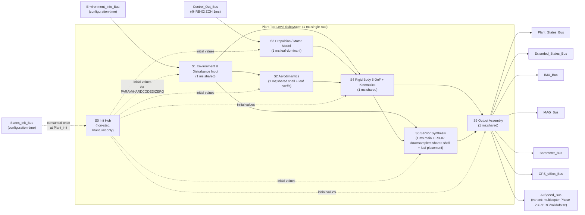

# C2 Plant 结构设计(Plant Structural Design)

## 1. 目的

为 FMT-Model-2025b Plant 模块在 [C1](C1-plant-functional.md) 已经锁定的 7 类物理 / 行为组件之上,给出**结构层契约**:在不重新设计物理保真度(C1 拥有)、不选择数值积分器(C4 拥有)、不下沉到多旋翼几何 / 电机 / 分配矩阵参数(C3 leaf 拥有)的前提下,锁定 (a) Plant 顶层子系统层次与每个子系统的速率 / Reset 行为;(b) Plant 侧消费 / 拥有的共享库块清单(per [A8 §4.2 / §4.3.1](../A-architecture/A8-shared-library-roster.md));(c) `model/plant/shared/` 共享骨架与 `model/plant/vehicles/multicopter/` leaf 之间的边界与变体接入点(per [A5 §4.1 / §4.2 / §4.3](../A-architecture/A5-variant-strategy.md));(d) Plant 内部慢传感器的 cadence 落地结构(per [A4 §4.4 RB-07](../A-architecture/A4-rate-boundaries.md));(e) Init / reset 入口的结构性安置(per [A6 §4.4 / §4.5](../A-architecture/A6-init-reset-contract.md));(f) 扰动注入点的结构性 mux 安置(per C1 §4.8 DI-01..DI-06);(g) Plant 输出 bus 的装配规则。本文件闭合 [00-design-plan §4.C C2 行](../00-design-plan.md):"子系统层次、共享库块清单、leaf 与 shared 边界"。

## 2. 范围

**在范围:**

- §4.1 Plant 顶层子系统层次(7 个子系统 + 1 init 子系统;每个标速率 / Reset / shared|leaf)
- §4.2 共享库块清单认领(per A8 §4.2 Layer A + §4.3.1 Layer B)
- §4.3 变体接入点枚举(per A5 §4.2 Phase 2 multicopter only;Variant Subsystem 落地形式)
- §4.4 各子系统内部信号流(块级粒度,无实现细节)
- §4.5 Plant 内部多速率边界(RB-07 cadence 落地为 sample-time-based downsampler 结构)
- §4.6 Init / reset 入口的结构性安置(顶层 Init Hub + 分布式 reset hooks)
- §4.7 扰动注入点的结构性 mux 安置(DI-01..DI-06)
- §4.8 输出 bus 装配规则(`Plant_States_Bus` / `Extended_States_Bus` / 5 sensor buses)
- §4.9 下游接入面(C3 leaf 接入点 / C4 数值接入点 / F1 ins_stub 消费点 / G1 harness 接入点)

**不在范围(由其他工作项处理):**

- 各物理组件的方程 / 保真度等级 / Phase 2 默认 fidelity 矩阵 — 由 [C1](C1-plant-functional.md) 处理(本文件**引用**,不重定义)
- 数值积分器选择 / 步长 / quat 单位化策略 / reset 时积分器内部数值行为 — 由 [C4](C4-numerics.md) 处理
- 多旋翼几何(arm length / motor positions / mass / inertia)/ 电机模型常数 / 分配矩阵 / 数值默认 — 由 [C3](C3-multicopter-leaf.md) 处理
- 触地检测算法细节(hysteresis 阈值、速度钳位实现) — 由 [C3](C3-multicopter-leaf.md) 落地数值,本文件仅锁定**共享触地块的结构位置**
- bus 字段级 schema(byte offset / 类型 / 顺序) — 由 [B1](../B-contracts/B1-bus-inventory.md) 拥有
- enum 数值 — 由 [B2](../B-contracts/B2-enum-inventory.md) 拥有
- PARAM 字段数值 / runtime-tunable 与 compile-inlined 分类 — 由 [B3 §4.3 PLANT_PARAM](../B-contracts/B3-parameter-schema.md) 拥有
- 故障注入分类 / 接口签名 / 触发参数 — 由 [H4](../H-verification/H4-fault-catalog.md) 处理(C2 仅落 DI-x mux 结构)
- 共享库块**内部实现** — 由 A8 §4.6 demoted to "implementation phase"(本文件遵守 A8,只**认领**)
- 共享库块**最终命名** — 由 [A2](../A-architecture/A2-naming-conventions.md) 拥有(本文件用 A8 工作名 placeholder)
- harness 顶层 .slx 装配(Plant block 在 G1 顶层模型中如何被实例化) — 由 [G1](../G-harness/G1-mil-toplevel.md) 处理
- ins_stub 内部如何从 `Plant_States_Bus` 派生 `INS_Out_Bus` — 由 [F1](../F-ins-contract/F1-ins-stub-functional.md) / [F2](../F-ins-contract/F2-ins-stub-structural.md) 处理
- INS 估计算法 — firmware-owned([架构 v1 §3 / §12.3](../../architecture/2026-05-05-fmt-model-architecture-v1.md))
- 固定翼 / VTOL Plant 结构 — A5 §4.4 OQ1 closure 推迟到 Phase 5

## 3. 依赖

环境注:FMT-Firmware 在本设计阶段未挂载,作者无法直接读取 `plant_interface.h` / `Plant_types.h` / `Plant.h`。本文件用 `FMT-Firmware @ <pending hash>` 占位指代 firmware tip;契约级 byte-for-byte 验证延迟到 [B4](../B-contracts/B4-contract-diff.md) 阶段。Plant 顶层 `Plant_init` / `Plant_step` 入口的无参签名约束由 [A6 §4.2.1](../A-architecture/A6-init-reset-contract.md) 拥有,本文件遵守不重述。

| 上游 | 引用位置 | 用途 |
|---|---|---|
| 架构 v1 §6 仓库树 | [链接](../../architecture/2026-05-05-fmt-model-architecture-v1.md) | `model/plant/shared/` + `model/plant/vehicles/multicopter/` 物理目录占位 |
| 架构 v1 §7.1 Plant 模块 split | 同上 | Plant mission(simulate physics)+ 不拥有估计 / mode / control law |
| 架构 v1 §10 Shared-vs-vehicle layering | 同上 | Layer A / B / C 三层划分;C2 用以确定 shared|leaf 边界 |
| 架构 v1 §11 Simulink/script/codegen layering | 同上 | Plant 顶层模型属于 "Simulink authoring layer";共享块走 Library |
| 架构 v1 §12.4 Plant internal architecture | 同上 | 6 阶段(Environment/Disturbance Inputs → Vehicle Dynamics Core → Actuator/Airframe-Specific Dynamics → Kinematics/Coordinate Conversion → Sensor Synthesis → Output Assembly);C2 §4.1 在此基础上加 init/reset hub 形成 7 个 step-time 子系统 + 1 个 non-step init 子系统 |
| 架构 v1 §13 Timing | 同上 | Plant single-rate 1 ms |
| 架构 v1 §17 Risk 3 / Risk 7 | 同上 | over-abstraction / variant complexity 防线 |
| [A1 §5.1.7 / §12.4 缺口](../A-architecture/A1-v1-review.md) | A1 表 | 闭合 §12.4 "internal multi-rate vs cadence-based publication" 的结构落地;闭合 §5.1.7 "optional 传感器准则" 的结构落地(由 §4.5 cadence 表 + §4.8 输出装配) |
| [A2 命名 / 单位 / 坐标系](../A-architecture/A2-naming-conventions.md) | A2 R-3.x / R-5 / R-7 | 本文件子系统 / 库块 / 内部 bus 命名遵循 A2;具体 Simulink 命名以 A2 落定为准(本文件用工作名) |
| [A3 §4.3 Plant 模块边界](../A-architecture/A3-module-boundaries.md) | A3 §4.3.1–4.3.7 | 输入 3 bus / 输出 7 bus 的 boundary contract,§4.4 / §4.8 引用 |
| [A4 §4.4 RB-01 / RB-02 / RB-07](../A-architecture/A4-rate-boundaries.md) | A4 §4.4 | RB-02(Controller→Plant ZOH)= Plant 输入端结构;RB-07 Plant 内部慢传感器 cadence 落地为 §4.5 downsampler 结构;RB-01(harness-variant)落 §4.9 / §4.3 variant point V-PS-CTRL |
| [A5 §4.1 / §4.2 / §4.3](../A-architecture/A5-variant-strategy.md) | A5 §4.1 / §4.2 / §4.3 | 顶层模型 = Library + Variant Subsystem 组合;Phase 2 单 active variant = multicopter;预算上限 5 Variant 块 / 模块 |
| [A6 §4.2 / §4.4 / §4.5 / §4.6](../A-architecture/A6-init-reset-contract.md) | A6 §4.2.1 / §4.4 / §4.5 / §4.6 | `Plant_init(void)` 签名 + Plant 不响应 `FMS_Out_Bus.reset` + reset 后稳态值类别 + init 反模式禁令;C2 §4.6 落地结构 |
| [A7 timestamp 约定](../A-architecture/A7-time-conventions.md) | A7 §4.1 / §4.6 | Plant 输出 bus `timestamp` 字段的时基 + ZERO-at-init 行为 |
| [A8 §4.2 / §4.3.1](../A-architecture/A8-shared-library-roster.md) | A8 §4.2(Layer A 37 块,1 open)+ §4.3.1(Layer B 5 块,1 open;Plant 拥有 5 个 shared shell)| C2 §4.2 单一来源(authoritative roster),C2 仅做"认领 / 弃权"(per A8 §4.6) |
| [B1 §4.4 / §4.5 / §4.8](../B-contracts/B1-bus-inventory.md) | B1 §4.4.1(`Control_Out_Bus`)+ §4.5.1–4.5.4(`Plant_States_Bus` / `Extended_States_Bus` / `Environment_Info_Bus` / `States_Init_Bus`)+ §4.8.1–4.8.5(IMU/MAG/Baro/GPS/AirSpeed)| Plant 边界 bus 字段级 schema 全在 B1;C2 仅引用 |
| [B3 §4.3 PLANT_PARAM](../B-contracts/B3-parameter-schema.md) | B3 §4.3.2 | PLANT_PARAM 34 字段;C2 §4.6.2 init 入口结构引用字段名(.01–.34),不重定义数值 |
| [C1 §4.1 / §4.5 / §4.6 / §4.7 / §4.8](C1-plant-functional.md) | C1 §4.1(7 类组件)+ §4.5(P1..P7 各组件功能行为)+ §4.6(传感器测量模型 + cadence)+ §4.7(init/reset 字段类别)+ §4.8(DI-01..DI-06 注入点)| 强前置;C2 直接复用,不重定义 |

co-seal batch:无(C2 是 [Wave 7](../01-design-relationships.md#6-推荐执行顺序基于关系图的拓扑) 4 个并行 solo author 之一,与 D2 / E2 / F2 同 Wave 但无内容互引)。

## 4. 设计内容

### 4.1 Plant 顶层子系统层次(top-level subsystem layout)

#### 4.1.1 顶层拓扑(Mermaid)



#### 4.1.2 子系统逐项(8 subsystems)

| ID | 子系统 | C1 §4.1 物理组件 | 速率 | Reset 行为(per A6 §4.4 / §4.5) | 归属 / Layer |
|---|---|---|---|---|---|
| **S0** | **Init Hub**(顶层非 step 子系统;Plant_init 入口) | C1.P7(init/reset 行为类) | non-step(仅在 `Plant_init(void)` 调用时执行一次) | (init 自身不被 reset;reset 后调用方负责重新进入 §4.6.3 reset 路径) | **shared**(Layer B `Plant_Reset_Hooks_Shell` per [A8 §4.3.1](../A-architecture/A8-shared-library-roster.md)) |
| **S1** | **Environment & Disturbance Input**(消费 `Environment_Info_Bus` + 扰动 mux DI-01) | C1.P5(扰动)+ C1.P6(环境模型) | 1 ms | TS-MIL-HARNESS only(per A6 §4.5);全字段 PARAM(per C1 §4.7 + A6 §4.4.2 `Environment_Info_Bus` 行)| **shared**(Layer B `Disturbance_Injector_Shell` per A8 §4.3.1)|
| **S2** | **Aerodynamics**(L2 多旋翼阻力;DI-01 注入点)| C1.P2(气动) | 1 ms | TS-MIL-HARNESS;字段 ZERO(气动力没有内部状态;若 L3 引入地效状态机,则该状态机 reset 由 S2 内部 hooks 接 S0)| **shared shell + leaf coeffs**:shell ∈ Layer B `Aero_Force_Frame_Shell` *(open per A8;Phase 2 mc-only 时退化为 leaf 内置块)*;`drag_lin_coef_b`(`PLANT_PARAM.12`)/ `drag_quad_coef_b`(`PLANT_PARAM.13`)由 C3 leaf 注入 |
| **S3** | **Propulsion / Motor Model**(L2 多旋翼 4 电机;DI-05 注入点)| C1.P3(推进) | 1 ms | TS-MIL-HARNESS;`motor_rpm[]` ZERO(per C1 §4.7.1 + A6 §4.4.2 行 "电机/舵面状态 ZERO 多旋翼默认");电机一阶滤波器内部状态 ZERO | **leaf-dominant**:几何(motor_pos / motor_dir / arm_length)/ 电机常数(thrust_max / time_const / thrust_curve / torque_const)全部 leaf;**shared 部分仅"通用一阶滤波器" `LowPass_Filter_1st`**(Layer A per A8 §4.2.2)|
| **S4** | **Rigid Body 6-DoF + Kinematics**(L4 完整 6-DoF;`Frame_Transform_NED_Body` 共享)| C1.P1(刚体 6-DoF) | 1 ms | TS-MIL-HARNESS;`pos_ned_m` / `vel_ned_mps` / `quat_ned_to_b` / `ang_rate_b_radps` PARAM(echo `States_Init_Bus`);`acc_ned_mps2` / `acc_b_mps2` / `ang_acc_b_radps2` ZERO;积分器内部状态 PARAM 或 ZERO(由 C4 决定,不得 PRESERVED per A6 §4.4.2)| **shared**(Layer B `Rigid_Body_Dynamics_Shell` per A8 §4.3.1);质量 / 惯量(`PLANT_PARAM.01` / `.02`)由 C3 leaf 注入 |
| **S5** | **Sensor Synthesis**(L3 IMU + L2 MAG/Baro;5 sensors;DI-04 / DI-06 注入点;RB-07 downsamplers)| C1.P4(传感器合成)| 1 ms 主循环 + RB-07 内部 cadence(MAG=10ms / Baro=20ms / GPS=200ms / AirSpeed=N/A)| TS-MIL-HARNESS;全字段 ZERO,`valid` HARDCODED false,`fix_type` HARDCODED no-fix(per C1 §4.7.3);warmup / GPS lock 计数器 ZERO | **shared shell + per-sensor blocks**:shell ∈ Layer B `Plant_Sensor_Synthesis_Shell`(per A8 §4.3.1);per-sensor 模型(IMU / MAG / Baro / GPS / AirSpeed)默认 shared(模型类与 cadence 与机型无关);**sensor placement offset** = leaf(per §4.3 V-SENSE-OFFSET)|
| **S6** | **Output Assembly**(7 bus Bus Creator + reset latch + timestamp)| C1.P1..P6 输出汇集 + C1.P7 reset 协议 | 1 ms | TS-MIL-HARNESS;全字段按各 bus 类别表(C1 §4.7);timestamp ZERO(per A7) | **shared**(Layer B 内置在 `Plant_Sensor_Synthesis_Shell` + 顶层装配;无独立 shared 块,使用 Layer A `Bus_Selector_Wrapped` 与显式 Bus Creator)|

**Step-time 子系统数量** = **7**(S1–S6 + S5 内嵌的 sensor downsamplers,但 downsamplers 仍在 S5 单 rate 1 ms 内实现 cadence)。**Non-step 子系统数量** = **1**(S0)。所有 step-time 子系统单 rate = 1 ms,与架构 v1 §13 + A4 §4.4 R1 (single-rate per module) 一致;Plant 内部**无**多速率 transition,RB-07 在 S5 内部由 sample-time-based downsampler / counter 实现(per A4 §4.4 RB-07 strategy + R3)。

#### 4.1.3 数据流总结(text)

```text
Plant_init(void):   States_Init_Bus + PLANT_PARAM ──┐
                                                    │
                                                    ▼
                                              S0 Init Hub
                                                    │
              ┌─────────┬─────────┬──────────┬──────┼──────┬─────────┐
              ▼         ▼         ▼          ▼             ▼         ▼
              S1        S2        S3         S4            S5        S6
        (init values to all step-time subsystems via Layer A `Reset_Composer` + `Bus_Selector_Wrapped`)

Plant_step(@ 1 ms):
    Control_Out_Bus  ──[RB-02 ZOH]──>   S3 Propulsion ──┐
                                                         ├──> sum forces/torques ──> S4 Rigid Body
    Environment_Info_Bus ──>  S1 Env/Dist ──> S2 Aero ──┤
                                                         │
                                       S5 Sensor Synth <─┴── S4 Rigid Body (truth state)
                                       S5 Sensor Synth <───── S1 Env/Dist (mag field, atm)
                                       S6 Output Asm <─────── all of S1..S5
                                       S6 Output Asm ──> 7 output buses
```

### 4.2 共享库块清单(per A8 §4.2 / §4.3.1)— 闭合退出条件 (b)

C2 **不重定义** A8 台账,只**认领 / 弃权**(per [A8 §4.6 认领协议](../A-architecture/A8-shared-library-roster.md#46-与下游c2d2e2的认领协议))。

#### 4.2.1 Layer A(`model/shared/lib/`)— C2 认领清单

下表逐行引用 [A8 §4.2](../A-architecture/A8-shared-library-roster.md#42-layer-a--shared-core-库块台账)。"消费 = yes" 表示 Plant 至少一个子系统 (S0..S6) 实例化或调用此块。

| A8 块名(working name) | A8 子目录 | C2 消费 | 消费子系统 | 备注 |
|---|---|---|---|---|
| `Quaternion_Mul` | `model/shared/lib/math/` | **yes** | S4(刚体 quat 积分)、S5(MAG truth derivation: `R(quat) * mag_field_ned`)| |
| `Quaternion_Conj` | `math/` | **yes** | S4(NED→body 旋转用共轭)、S5 | |
| `Quaternion_Normalize` | `math/` | **yes** | S4(quat 单位化频率由 C4 锁定) | |
| `Quat_To_Rotation_Matrix` | `math/` | **yes** | S4(`R_b_to_ned`)、S2(`R_ned_to_b` for relative wind)、S5 | |
| `Rotation_Matrix_To_Quat` | `math/` | **no** | — | C2 不需要逆向转换;harness / 日志若需要走 G3 |
| `Euler_To_Quat` | `math/` | **yes**(仅在 S0 init 路径) | S0(若 `States_Init_Bus.quat_ned_to_b` 默认通道是 quat 直入则不必;若 leaf 提供 euler-form init 则启用)| 由 C3 leaf init 表决定;C2 保留接入点 |
| `Quat_To_Euler` | `math/` | **yes**(仅 S6 输出 `euler_ned_to_b_rad` 字段)| S6 | per [B1 §4.5.1](../B-contracts/B1-bus-inventory.md#451-plant_states_bus) 该字段存在 |
| `Vec3_Cross` | `math/` | **yes** | S3(`cross(motor_pos, F)` 力矩合成)、S4(`cross(omega, I*omega)` 离心校正)| |
| `Vec3_Dot` | `math/` | **no** | — | Plant 不需要点积 |
| `Frame_Transform_NED_Body` | `math/` | **yes** | S2(NED→body wind)、S4(body→NED acceleration)、S5(MAG / GPS LLA 转换)| 注:多个 wrapper,语义统一 |
| `LowPass_Filter_1st` | `model/shared/lib/filters/` | **yes** | S3(电机一阶动态)、S5(可选 Baro 后端平滑)| |
| `HighPass_Filter_1st` | `filters/` | **no** | — | |
| `Notch_Filter` | `filters/` | **no** | — | 角速率环抑振属 Controller 范围(E2);Plant 不消费 |
| `Moving_Average` | `filters/` | **no** | — | G3 日志可消费,但不在 Plant step path |
| `Rate_Limiter` | `filters/` | **no** | — | 命令整形归 D2;Plant 不消费 |
| `Slew_Limiter` | `filters/` | **no** | — | 同上 |
| `Deadzone` | `filters/` | **no** | — | 同上 |
| `Saturation_Symmetric` | `filters/` | **yes**(可选)| S3(motor_cmd 输入 `[0, 1]` 钳位)| 防御性饱和,leaf 数值 |
| `Saturation_Asymmetric` | `filters/` | **no** | — | |
| `Mission_Item_Decoder` | `model/shared/lib/guidance/` | **no** | — | FMS 范围 |
| `Waypoint_Distance_Calc` | `guidance/` | **no** | — | FMS 范围 |
| `Geofence_Check` | `guidance/` | **no** | — | FMS 范围 |
| `PID_Block` | `model/shared/lib/control/` | **no** | — | Controller 范围 |
| `AntiWindup_BackCalc` | `control/` | **no** | — | Controller 范围 |
| `FeedForward_Composer` | `control/` | **no** | — | Controller 范围 |
| `Threshold_Latch` | `model/shared/lib/safety/` | **no** | — | FMS 范围;Plant 不做安全决策 |
| `Hysteresis_Comparator` | `safety/` | **yes**(可选,触地检测)| S4(on_ground latch;具体阈值由 C3 leaf,per C1-OQ9)| C2 保留结构;若 C3 选择不复用,downgrade to leaf 块 |
| `Validity_AND` | `safety/` | **no** | — | INS / FMS 消费;Plant 自己只发布 validity,不组合 |
| `Validity_OR` | `safety/` | **no** | — | 同上 |
| `Stale_Detector` | `safety/` | **no** | — | Plant 不消费时间戳 staleness(自身是产出方)|
| `Range_Check` | `safety/` | **yes**(可选,Plant 输出健全性)| S6(`Plant_States_Bus.pos_ned_m` 量级检测,异常时 G3 日志告警)| 仅 harness debug,Phase 2 默认 disabled |
| `Bus_Selector_Wrapped` | `model/shared/lib/utilities/` | **yes** | S0 / S6(reset 默认值 hook)| |
| `Enum_Constant` | `utilities/` | **yes** | S5 / S6(GPS `fix_type=NO_FIX` 等 enum 常量 per [B2 `UbloxFixType`](../B-contracts/B2-enum-inventory.md))| |
| `Unit_Cast` | `utilities/` | **yes** | S5(GPS lat/lon: rad→deg;baro: pa→m altitude;mag: gauss↔T)| |
| `Fixed_Step_Counter` | `utilities/` | **yes** | S5(MAG 10ms / Baro 20ms / GPS 200ms / GPS lock 5s 计数器)| 是 RB-07 cadence 落地的核心组件,见 §4.5 |
| `Reset_Composer` | `utilities/` | **yes** | S0(组合 init 触发 + 各子系统 reset hook 信号)| |

**Layer A 认领统计**:Plant 消费 **19** 块(`Quaternion_Mul` / `Quaternion_Conj` / `Quaternion_Normalize` / `Quat_To_Rotation_Matrix` / `Euler_To_Quat`(conditional)/ `Quat_To_Euler` / `Vec3_Cross` / `Frame_Transform_NED_Body` / `LowPass_Filter_1st` / `Saturation_Symmetric`(conditional)/ `Hysteresis_Comparator`(conditional)/ `Range_Check`(conditional debug)/ `Bus_Selector_Wrapped` / `Enum_Constant` / `Unit_Cast` / `Fixed_Step_Counter` / `Reset_Composer` + 上面 17 个稳定项 + 2 conditional 真消费),弃权 **18** 块(主要是 control / guidance / safety 范畴 — Plant 不做命令整形 / 制导 / 安全决策)。

#### 4.2.2 Layer B(`model/plant/shared/`)— C2 认领清单

逐行引用 [A8 §4.3.1](../A-architecture/A8-shared-library-roster.md#431-modelplantshared--plant-共享架构块)。

| A8 块名 | A8 子目录 | C2 认领 | C2 §4.1 子系统映射 | 备注 |
|---|---|---|---|---|
| `Plant_Sensor_Synthesis_Shell` | `model/plant/shared/` | **yes** | **S5 Sensor Synthesis** 整体骨架 | 含 IMU / MAG / Baro / GPS / AirSpeed 五合一 shell;每个传感器内部块为 shared(机型无关测量模型)+ leaf(sensor placement offset;per §4.3 V-SENSE-OFFSET);`AirSpeed_Bus` 输出 valid=false multicopter only,但端口结构存在 |
| `Rigid_Body_Dynamics_Shell` | `model/plant/shared/` | **yes** | **S4 Rigid Body 6-DoF + Kinematics** 整体骨架 | 6-DoF Newton-Euler + 四元数姿态(L4)框架;mass / inertia 端口由 C3 leaf 注入 PARAM |
| `Aero_Force_Frame_Shell` *(open in A8 §4.5)* | `model/plant/shared/` | **yes (Phase 2 留 Layer B,候选)** | **S2 Aerodynamics** 整体骨架 | A8 §4.5 标 open;Phase 2 多旋翼气动是 L2 简单阻力(几乎无机型差异),C2 选择**保留 Layer B**(Phase 5 fixwing 加入时直接复用框架);若 A8 决议下沉,本认领回退为弃权 |
| `Disturbance_Injector_Shell` | `model/plant/shared/` | **yes** | **S1 Environment & Disturbance Input**(主)+ S5 / S3 / S6 各自接入 DI-01..DI-06 mux | 详见 §4.7 |
| `Plant_Reset_Hooks_Shell` | `model/plant/shared/` | **yes** | **S0 Init Hub** + 各子系统 reset hook 接口 | 详见 §4.6 |

**Layer B 认领统计**:Plant 拥有 **5** 个 Layer B shells(per A8 §4.3.1 全表),零弃权。所有 5 个均被 §4.1 各子系统消费。

#### 4.2.3 Layer C(leaf in `model/plant/vehicles/multicopter/`)— C3 委托清单

A8 §4.4 显式不枚举 Layer C;C2 在此**为 C3 落地**列出 Plant 侧多旋翼 leaf **应包含**的块清单(C3 在自己的退出条件中具体填数值)。

| Leaf 块(working name) | 物理位置 | 来源(C2 委托给 C3 的理由)| C2 子系统接入点 |
|---|---|---|---|
| `MC_Geometry_Constants` | `model/plant/vehicles/multicopter/geometry/` | 几何参数(arm_length / motor_pos_b / motor_dir);每机型独有(per A5 §4.2 Phase 2 frozen 多旋翼 4 电机)| S3(力矩合成所需位置)+ S5(sensor placement offset 经 V-SENSE-OFFSET) |
| `MC_Mass_Inertia` | `model/plant/vehicles/multicopter/mass/` | `PLANT_PARAM.01` mass + `PLANT_PARAM.02` inertia tensor;数值 by C3 | S4(刚体动力学注入) |
| `MC_Motor_Model_Coeffs` | `model/plant/vehicles/multicopter/motor/` | thrust_max / time_const / thrust_curve / torque_const;PLANT_PARAM.08–.11 | S3(电机一阶滤波 + thrust 多项式) |
| `MC_Allocation_Matrix` | `model/plant/vehicles/multicopter/allocation/` | 由 motor_pos × motor_dir 派生(可静态计算 also leaf 可视化);多旋翼 X/+/六/八 拓扑(Phase 2 仅 X/+ 之一)| S3(力 / 力矩 → motor 命令的反向用于 Controller;Plant 侧仅前向使用 motor → 力 / 力矩,per C1 §4.5.3)|
| `MC_Sensor_Placement_Offsets` | `model/plant/vehicles/multicopter/sensors/` | IMU / MAG / Baro 在 body 系的位置 / 姿态 offset;Phase 2 默认全零(传感器在 IMU body 中心),为 SIH 升级保留接入点 | S5(per §4.3 V-SENSE-OFFSET)|
| `MC_Init_Defaults` | `model/plant/vehicles/multicopter/init/` | `States_Init_Bus` 多旋翼默认值(`PLANT_PARAM.29–.32` echo)| S0(per §4.6.1)|
| `MC_Ground_Detect_Params` | `model/plant/vehicles/multicopter/ground/` | 触地检测 hysteresis 阈值(per C1-OQ9 + R-4)| S4(on_ground latch via Layer A `Hysteresis_Comparator`)|

注:具体字段名 / 数值 / `MC_Allocation_Matrix` 的 X vs + 选择 / sensor offset 默认零的合理性 / 触地阈值数值 — 全部留 C3。C2 仅锁定**接入面**与**leaf 块的存在性**。

#### 4.2.4 Open / 待裁决项

- **`Aero_Force_Frame_Shell`(A8 §4.5 open candidate)**:C2 选择 Phase 2 留 Layer B;若 C3 实施后发现"多旋翼气动确无可复用骨架"(L2 阻力公式过于简单,shell 仅是空壳),触发 A8 §4.6 demote 流程。
- **`Hysteresis_Comparator`(Layer A)在触地检测中的复用**:C1-OQ9 委托给 C2 + C3;C2 倾向**复用 Layer A**(简洁、维护少),具体数值与是否双阈值由 C3。若 C3 决定触地需要更复杂逻辑(例如 触地 + 速度 + 推力 三维决策),则下沉为 leaf 专用块。

### 4.3 变体接入点(variant attachment points)— per A5

按 [A5 §4.1 / §4.2 / §4.3 预算上限](../A-architecture/A5-variant-strategy.md#4-设计内容)。

#### 4.3.1 顶层模型机制(per A5 §4.1)

| 顶层 | 机制 | Phase 2 实例化 | 备注 |
|---|---|---|---|
| `model/plant/Plant.slx`(整机 Plant 顶层)| **Library** + 顶层 plain Subsystem | 1 个实例,被 G1 harness 消费 | per A5 §4.1 顶层模型默认 Library;Plant 不使用 Model Reference(Phase 2 单 vehicle,无需 Reference 隔离)|
| `model/plant/shared/*.slx`(5 个 Layer B shells)| **Library**(per A5 §4.1.4 默认推荐 Library)| 库 ".slx",在 `Plant.slx` 顶层被 Library Link 引用 | per A5 §4.1.4 / A8 §4.1.4 |
| `model/plant/vehicles/multicopter/*.slx`(leaf 块)| **Variant Subsystem**(per A5 §4.2 Phase 2 单 active variant)| 1 个 active variant = `MULTICOPTER` | per A5 §4.2.2 |

#### 4.3.2 Plant 模块 Variant 接入点枚举(Variant Subsystem instances)

每个 Variant Subsystem 在 Phase 2 仅 1 个 active variant(`{MULTICOPTER}`),但结构必须就位以便 Phase 5 加入 fixwing / vtol(per A5 §4.2 + §4.4 OQ1)。

| Variant ID | 接入点(C2 §4.1 子系统 + 内部位置)| Phase 2 active | Phase 5+ 候选 | A5 §4.3 预算合规 |
|---|---|---|---|---|
| **V-AERO** | S2 Aerodynamics 内部 — 切换不同机型气动模型 | `MC_Aero_L2_Drag`(linear+quad drag,per C1 §4.5.2) | `FW_Aero_Lifting_Surface`、`VTOL_Aero_Hybrid` | enclosing 1 vehicle,depth 1 |
| **V-PROP** | S3 Propulsion / Motor Model 内部 — 切换不同机型推进结构(电机数量 / 推力轴方向 / 油门曲线)| `MC_Propulsion_4Rotor`(可参数化 X / + topology by `MC_Allocation_Matrix`)| `FW_Propulsion_PullProp`、`VTOL_Propulsion_Quad+Pusher`、`Boat_Propulsion_Diff`、`Car_Propulsion_RearDrive`| enclosing 1 vehicle,depth 1 |
| **V-INERTIA** | S4 Rigid Body 6-DoF 内部 — 切换 mass / inertia 数据来源(只读 PLANT_PARAM,无逻辑差异)| `MC_Mass_Inertia` | per-vehicle mass/inertia leaf | enclosing 1 vehicle,depth 1 |
| **V-SENSE-OFFSET** | S5 Sensor Synthesis 内部 — 传感器在 body 系的安装 offset | `MC_Sensor_Placement_Offsets`(默认全零)| `FW_Sensor_Placement_Offsets` 等 | enclosing 1 vehicle,depth 1 |
| **V-INIT-DEFAULTS** | S0 Init Hub 内部 — `States_Init_Bus` 默认值组合(per A6 §4.4.2 各机型 leaf 例外)| `MC_Init_Defaults` | per-vehicle init defaults | enclosing 1 vehicle,depth 1 |

**Plant 模块 Variant 块总数 = 5**;[A5 §4.3.1 预算上限](../A-architecture/A5-variant-strategy.md#431-variant-subsystem-容量预算) 给定单模块 Variant 块 ≤ **5**(预算线 5,余量 0)。**触发 §4.3.4 review checkpoint(A5)**:由于 Plant 已经"顶到预算",C2 必须在 §5 风险登记 R-3,并在 Phase 5 启动前与 A5 reviewer 协调是否需要拆分(例如把 V-INIT-DEFAULTS 从 Variant Subsystem 改为 PARAM 路径以释放 1 个 Variant 槽)。

#### 4.3.3 显式冻结的非变体维度(per A5 §4.2)

下列维度 Phase 2 **不**通过 Variant Subsystem 表达,与 A5 §4.2 一致:

- **Sensor 集合**:Phase 2 多旋翼 mandatory = IMU/MAG/Baro/GPS;`AirSpeed_Bus` 字段保留但 valid=false(per C1 §4.4 + A3 §4.3.7.5);**不**为"启用 / 禁用某传感器"开 Variant 块。
- **Mission 类型 / 分支**:Plant 不消费 `Mission_Data_Bus`(per C1 §4.3 显式排除);非 Plant 关注。
- **Actuator 数量 / 拓扑**:Phase 2 多旋翼 4 电机(per A5 §4.2 frozen);**不**为 6/8 电机 / 倾转开 Variant 块(C3 leaf 内部用 PARAM 长度 + 默认 4 实现,Phase 5 leaf 加入新 vehicle 才用 V-PROP)。
- **数值精度(单 / 双)**:Phase 2 单一选择(per A5 §4.2 + I4 codegen);Plant 内部不并存两套精度。
- **环境模型升级(L1 → L2)**:由 PLANT_PARAM 字段开关或 Phase 4+ 升级(per C1 §4.2.3),**不**走 Variant 块。
- **保真度 ladder 升级(L1↔L4)**:由 PLANT_PARAM 字段开关 + C2 / C3 在 §4.4 各子系统内置升级 hooks 实现,**不**走 Variant 块。

#### 4.3.4 Phase 2 Variant 单 active 元素

| Variant 块 | Phase 2 active variant ID | 来源 |
|---|---|---|
| V-AERO | `MULTICOPTER` | C3 leaf |
| V-PROP | `MULTICOPTER` | C3 leaf |
| V-INERTIA | `MULTICOPTER` | C3 leaf |
| V-SENSE-OFFSET | `MULTICOPTER` | C3 leaf |
| V-INIT-DEFAULTS | `MULTICOPTER` | C3 leaf |

变体控制变量名(单一全局 enum / 字符串)由 [A2](../A-architecture/A2-naming-conventions.md) 落定;C2 工作名 placeholder = `PLANT_VEHICLE_VARIANT`,Phase 2 取值集合 = `{MULTICOPTER}`(degenerate)。

### 4.4 子系统内部信号流(subsystem-by-subsystem internal signal flow)

每个子系统给出 inputs / outputs / internal blocks(块名引用 §4.2 Layer A / B / leaf)/ 跨子系统接口。**不含**任何方程(C1 已给)、积分器选择(C4 范围)、数值常数(C3 leaf 范围)。

#### 4.4.1 S0 Init Hub

```text
inputs:
  - States_Init_Bus              (configuration-time)
  - PLANT_PARAM (struct)         (per B3 §4.3.2)
  - external init trigger        (Plant_init() 调用一次)
internal blocks:
  - Layer B: Plant_Reset_Hooks_Shell
      - dispatcher: 把 (PARAM | HARDCODED | ZERO | PRESERVED) 类别值分发到各 step-time 子系统的 Init Port
      - (PRESERVED 在 Phase 2 不使用,per A6 §4.4.2 + C1 §4.7)
  - Layer A: Reset_Composer       (合成 init 触发与 reset 触发到统一 Init Port 路径)
  - Layer A: Bus_Selector_Wrapped (从 States_Init_Bus 取出 pos/vel/quat/ang_rate 等字段)
  - Variant: V-INIT-DEFAULTS     (per §4.3.2;Phase 2 = MC_Init_Defaults)
outputs:
  - init_values_bus (internal)    (路由到 S1..S6 的 Init Port)
  - init_trigger    (internal)    (S1..S6 在第一次 step 之前从 Init Port 锁存 init_values_bus)
contract:
  - Plant_init(void) signature: enforced by codegen frame, per A6 §4.2.1
  - 副作用边界 per A6 §4.2.2: 只读 PLANT_PARAM + States_Init_Bus;不写文件 / 不读 wall-clock / 不调度其他模块 init
```

#### 4.4.2 S1 Environment & Disturbance Input

```text
inputs:
  - Environment_Info_Bus          (configuration-time;per A3 §4.3.3 / B1 §4.5.3)
  - DI-01 mux source              (PLANT_PARAM.23 wind base + optional H4 Dryden / gust input)
  - Init Port from S0
internal blocks:
  - Layer B: Disturbance_Injector_Shell (DI-01 mux instance)
      - sub: wind_base_const       (PLANT_PARAM.23 wind_vel_ned_mps)
      - sub: turbulence_optional   (Phase 2 默认 disabled;per C1 §4.5.5 L2 启用时为 Dryden filter)
  - Layer A: Bus_Selector_Wrapped  (展开 Environment_Info_Bus)
outputs (internal):
  - gravity_ned_mps2               → S4 (rigid body)
  - air_density_kgpm3              → S2 (aero)
  - mag_field_ned_gauss            → S5 (MAG truth derivation)
  - air_pressure_pa, air_temp_k    → S5 (Baro reference)
  - home_lat/lon/alt               → S5 (GPS LLA conversion)
  - wind_total_ned_mps             → S2 (aero relative wind)
contract:
  - 全字段 PARAM-class at init/reset (per A6 §4.4.2 Environment_Info_Bus 行)
  - Reset behavior: TS-MIL-HARNESS 重新读取 Environment_Info_Bus(等价 init)
```

#### 4.4.3 S2 Aerodynamics

```text
inputs:
  - vel_ned_mps, quat_ned_to_b     (from S4)
  - wind_total_ned_mps              (from S1, post-DI-01)
  - air_density_kgpm3               (from S1)
  - drag_lin_coef_b, drag_quad_coef_b (PLANT_PARAM.12 / .13 via leaf MC_Aero_Coeffs)
  - Init Port from S0
internal blocks:
  - Variant: V-AERO                 (Phase 2 active = MC_Aero_L2_Drag)
      - sub (in MC variant): relative wind compose + linear/quadratic drag (per C1 §4.5.2)
      - uses Layer A: Frame_Transform_NED_Body, Quat_To_Rotation_Matrix
  - Optional shell: Layer B Aero_Force_Frame_Shell (per A8 §4.5 open; Phase 2 = pass-through wrapper)
outputs (internal):
  - F_aero_b_n                      → S4 sum_forces
  - M_aero_b_nm                     → S4 sum_torques (Phase 2 multicopter L2 = zero per C1 §4.5.2)
contract:
  - 无内部状态;Reset = stateless(若 L3 加入地效状态机,则状态由 S2 内部 Init Port 管理)
```

#### 4.4.4 S3 Propulsion / Motor Model

```text
inputs:
  - Control_Out_Bus.motor_cmd[]     (from RB-02 ZOH)
  - Control_Out_Bus.actuator_cmd[]  (passthrough only;Phase 2 multicopter 不消费 actuator_cmd 但保留接口)
  - leaf params: MC_Geometry_Constants + MC_Motor_Model_Coeffs (PLANT_PARAM.04, .06, .07, .08, .09, .10, .11)
  - DI-05 mux source                (H4 motor failure scaling)
  - Init Port from S0
internal blocks:
  - Variant: V-PROP                 (Phase 2 active = MC_Propulsion_4Rotor)
      - sub: motor_cmd_saturation   (Layer A Saturation_Symmetric clamp [0,1])
      - sub: motor_first_order      (per-motor Layer A LowPass_Filter_1st;tau = motor_time_const_s)
      - sub: thrust_polynomial      (PLANT_PARAM.11 [a0, a1, a2])
      - sub: motor_failure_mux      (DI-05 multiplier;Phase 2 default = 1.0)
      - sub: torque_compose         (motor_dir × torque_const_nmpn × thrust)
      - sub: force_torque_compose   (Layer A Vec3_Cross over motor_pos × thrust + sum torque)
      - sub: rpm_estimate           (sqrt(thrust / k_t),per C1 §4.5.3;k_t leaf-provided)
outputs (internal):
  - F_motor_b_n                     → S4 sum_forces
  - M_motor_b_nm                    → S4 sum_torques
  - motor_rpm[]                     → S6 (Plant_States_Bus.motor_rpm)
  - motor_thrust_per_n[]            → S6 (Extended_States_Bus, optional trace)
contract:
  - 一阶滤波器内部状态:per A6 ZERO at init (PLANT_PARAM 不用于电机滤波器初值);Reset 同
  - DI-05 mux:Phase 2 default scale = 1.0;H4 forward-cite
```

#### 4.4.5 S4 Rigid Body 6-DoF + Kinematics

```text
inputs:
  - F_b_total_n  = F_motor_b_n + F_aero_b_n + F_disturbance_b_n (DI-02)
  - M_b_total_nm = M_motor_b_nm + M_aero_b_nm + M_disturbance_b_nm (DI-03)
  - mass_kg, inertia_b_kgm2          (leaf MC_Mass_Inertia)
  - gravity_ned_mps2                  (from S1)
  - Init Port from S0
internal blocks:
  - Layer B: Rigid_Body_Dynamics_Shell
      - translational: F/m + gravity → integrate twice (integrators by C4)
      - rotational: inv(I) * (M - omega × I*omega) → integrate (by C4)
      - quat propagation: 0.5 * Omega(omega) * quat → integrate + Layer A Quaternion_Normalize
      - kinematic: Layer A Quat_To_Rotation_Matrix + Frame_Transform_NED_Body
      - specific force compose: a_b = R_ned_to_b * (a_ned - g_ned)
  - Variant: V-INERTIA              (Phase 2 = MC_Mass_Inertia)
  - Ground contact subblock:
      - Layer A: Hysteresis_Comparator on (pos_ned_m.z - ground_z) (leaf MC_Ground_Detect_Params)
      - on_ground latch + velocity clamp on contact (per C1 §4.5.1; algorithm details by C3 per C1-OQ9)
outputs (internal):
  - pos_ned_m, vel_ned_mps, acc_ned_mps2, acc_b_mps2   → S5, S6
  - quat_ned_to_b                                       → S5, S6
  - ang_rate_b_radps, ang_acc_b_radps2                  → S5, S6
  - on_ground                                           → S6 (Plant_States_Bus.on_ground)
contract:
  - 积分器内部状态 reset class: PARAM (echoes States_Init_Bus) per A6 §4.4.2;不允许 PRESERVED
  - Quaternion 单位化策略:由 [C4](C4-numerics.md) 锁定;C2 仅放置 Layer A Quaternion_Normalize 块
```

#### 4.4.6 S5 Sensor Synthesis(含 RB-07 downsamplers — 详见 §4.5)

```text
inputs:
  - truth state from S4 (pos / vel / acc / quat / ang_rate)
  - environment from S1 (mag_field_ned, air_pressure/temp, home_lat/lon/alt)
  - PLANT_PARAM noise σ + bias init   (PLANT_PARAM.14–.22)
  - DI-04 mux source                   (H4 noise/bias drift)
  - DI-06 mux source                   (H4 GPS-denied)
  - leaf: MC_Sensor_Placement_Offsets  (Phase 2 default zero)
  - Init Port from S0
internal blocks:
  - Layer B: Plant_Sensor_Synthesis_Shell
      - per-sensor sub-blocks (5):
          - IMU_Synthesis    (1 ms cadence; gyro + accel; bias + noise; per C1 §4.6.1)
          - MAG_Synthesis    (10 ms cadence via Layer A Fixed_Step_Counter + ZOH latch)
          - Baro_Synthesis   (20 ms cadence)
          - GPS_Synthesis    (200 ms cadence + GPS lock state machine)
          - AirSpeed_Synthesis (variant-conditional;Phase 2 multicopter = ZERO + valid=false)
      - validity flag generators (per C1 §4.6.4 contract)
      - DI-04 noise/bias H4 mux entry per sensor
      - DI-06 GPS lock H4 mux entry on GPS_Synthesis only
  - Variant: V-SENSE-OFFSET           (Phase 2 = MC_Sensor_Placement_Offsets, all-zero)
  - Layer A: Quat_To_Rotation_Matrix (MAG truth: R(quat) * mag_field_ned)
  - Layer A: Frame_Transform_NED_Body (GPS LLA conversion via MC LLA helper)
  - Layer A: Unit_Cast (rad↔deg, pa↔m, gauss↔T)
  - Layer A: Enum_Constant (UbloxFixType.NO_FIX / GPS_3D_FIX per B2)
outputs (internal):
  - imu_signals (gyr, acc) [@ 1 ms]
  - mag_signals             [@ 10 ms latched]
  - baro_signals            [@ 20 ms latched]
  - gps_signals             [@ 200 ms latched]
  - airspeed_signals        [variant; multicopter Phase 2 ZERO/valid=false]
  - all per-sensor validity flags [latched on respective cadences]
contract:
  - Reset class per C1 §4.7.3:全字段 ZERO,validity HARDCODED false,GPS fix_type HARDCODED NO_FIX
  - Warmup counters reset 时归零(per C1 §4.6.4)
```

#### 4.4.7 S6 Output Assembly

```text
inputs (internal):
  - all signals from S1..S5 (truth state, sensor signals, validity flags)
  - timestamp source (per A7 — Plant 1 ms step counter × 1ms; ZERO at init)
  - Init Port from S0
internal blocks:
  - Bus Creator: Plant_States_Bus       (per B1 §4.5.1 field schema)
  - Bus Creator: Extended_States_Bus    (per B1 §4.5.2)
  - Bus Creator: IMU_Bus, MAG_Bus, Barometer_Bus, GPS_uBlox_Bus, AirSpeed_Bus (per B1 §4.8.1–4.8.5)
  - Layer A: Quat_To_Euler              (Plant_States_Bus.euler_ned_to_b_rad derived field)
  - Layer A: Bus_Selector_Wrapped       (reset default values hook)
  - Layer A: Range_Check (optional;debug only;Phase 2 default disabled)
  - timestamp insertion block           (writes PLANT_STATE_BUS.timestamp; per A7)
outputs (external):
  - 7 output buses → Plant top-level boundary
contract:
  - Bus 字段顺序、类型、命名严格遵循 B1(Bus Object 定义);C2 不重定义
  - Reset class: 全字段按 C1 §4.7 类别表;timestamp ZERO at init/reset (per A7)
  - per A6 §4.5.2:Plant 不响应 FMS_Out_Bus.reset (本子系统不暴露 FMS reset 输入端口)
```

### 4.5 Plant 内部多速率边界(RB-07 cadence 落地)

per [A4 §4.4 RB-07](../A-architecture/A4-rate-boundaries.md#rb-07-plant-1-ms--慢传感器输出plant-模块内部) 委托 cadence 数值给 [C1 §4.6.1](C1-plant-functional.md#461-各传感器测量模型表l3-default)。C2 给出**结构落地**:

#### 4.5.1 RB-07 在 Plant 内部的实现拓扑

Plant 主循环统一在 1 ms 单速率运行(per 架构 v1 §13 + A4 R1)。慢传感器**不引入第二个 sample-time**,而是用 "1 ms 主循环 + counter + ZOH latch" 模式实现 cadence:

```text
per slow sensor (MAG, Baro, GPS):
  internal block group (in S5 Sensor Synthesis):
    cadence_counter (Layer A Fixed_Step_Counter, period = sensor_cadence_ms / 1ms)
        ↓ on counter wrap
    sensor_sample_trigger (boolean pulse, 1 ms wide)
        ↓
    sensor_truth_compute (only when triggered;else gated to previous output)
        ↓
    output_latch (ZOH;持续维持上次采样输出,直到下一次 trigger)
        ↓
    sensor_bus_field (Bus Creator in S6 reads latched value)
```

| Sensor | Cadence(per C1 §4.6.1)| Counter wrap value | ZOH 维持 | Validity 行为 |
|---|---|---|---|---|
| IMU | 1 ms | N/A(每 step 都更新)| no latch | warmup counter PARAM(C1 §4.6.4 默认 0) |
| MAG | 10 ms | 10 | 9 ms ZOH between samples | warmup PARAM(默认 0) |
| Baro | 20 ms | 20 | 19 ms ZOH | warmup PARAM(默认 0) |
| GPS | 200 ms | 200 | 199 ms ZOH | GPS lock 状态机:counter ≥ `T_gps_lock_s / 1ms`(默认 5000)后 valid=true / fix_type=GPS_3D_FIX(per C1 §4.6.4 + B2) |
| AirSpeed | N/A(multicopter Phase 2 disabled)| N/A | output ZERO + valid=false 永久 | per C1 §4.4 / A3 §4.3.7.5 |

#### 4.5.2 Latency 注入点

Plant 内部默认 latency = 0 跨子系统。**显式 latency 注入位置**(为 Phase 3+ SIH-class fidelity 预留 hooks):

| 注入点 | 位置 | 默认 Phase 2 | 升级路径 |
|---|---|---|---|
| sensor sampling latency | each `sensor_sample_trigger` 之后,output_latch 之前 | 0 ms | L4 升级:1–10 ms unit-delay,具体由 SIH 阶段(C1 §4.2.3)|
| GPS lock latency | GPS lock 状态机 | 5 s(模拟卫星捕获,per C1 §4.6.4) | 不变(已是真实行为) |

不在 Plant 内部建立其它 latency;harness / ins_stub 路径的 latency(per [F1 / F2](../F-ins-contract/F1-ins-stub-functional.md))由 F 区拥有。

#### 4.5.3 与 A4 R1 / R3 / 整数倍约束的合规验证

- **R1**(single-rate per module):Plant 内部唯一 sample-time = 1 ms;cadence 由 counter + ZOH 实现,不引入新的 sample-time。**合规**。
- **R3**(快→慢用 sample-time-based downsample,不平均不滤波):counter + ZOH 即 sample-time-based downsample 等价语义;中间无 averaging。**合规**。
- **整数倍**(per A4 §4.5):10 / 20 / 200 ms 全部为 1 ms 的整数倍。**合规**。

#### 4.5.4 `Plant_States_Bus` vs sensor buses 发布速率

- `Plant_States_Bus` / `Extended_States_Bus`:每 1 ms 全字段更新(无 cadence latching;truth state)。
- 5 个 sensor buses:cadence 受限,字段在 ZOH 期内保持上次采样值;`valid` flag 在 cadence trigger 时更新,在 ZOH 期内保持上次值。
- 这与 A3 §4.3.5–4.3.7 + B1 §4.5.1 / §4.8 一致(Plant_States_Bus.timestamp 字段每 1 ms 更新,sensor_bus.timestamp 字段在各自 cadence 上更新)。

### 4.6 Init / reset 入口的结构性安置(per A6)

#### 4.6.1 顶层 Init Hub vs 分布式 reset hooks 决策

C2 选择**混合模式**:

- **顶层 Init Hub(S0)**:负责 `Plant_init(void)` 的一次性入口,集中读取 `States_Init_Bus` + `PLANT_PARAM`,经 Variant V-INIT-DEFAULTS 选机型默认值,通过 Layer A `Reset_Composer` 把 init_values_bus 分发到 S1..S6 各自的 Init Port。
- **分布式 reset hooks**:每个 step-time 子系统(S1–S6)内部携带自己的 Init Port + Reset hook(由 Layer B `Plant_Reset_Hooks_Shell` 提供统一接口),负责把内部状态 / 积分器 / counter / latch 在 init / reset 时回到合约稳态值。

理由:

- A6 §4.2.2 要求 init 副作用最小化(只读 PARAM);顶层 Init Hub 满足这一约束。
- A6 §4.4 的稳态值类别(PARAM / HARDCODED / ZERO)按字段粒度生效,需要每个子系统**在自己的位置**应用,不能集中在顶层用一个巨型 Bus Creator(那会破坏单一职责并使 reset 时差很难调试)。
- A6 §4.5 列出 5 类 reset 触发源,Plant 仅响应 **TS-MIL-HARNESS**(per A6 §4.5.2 关键约束 1:"global reset 不联动 Plant reset"),所以 reset 入口在 harness 边界上,每个子系统用同一 Reset Port 接收。

#### 4.6.2 Init Hub(S0)结构

```text
Plant_init(void) — invoked once at simulation start (MIL) or never (firmware path; Plant not in firmware runtime per arch v1 §3 / §15.4)
    ↓
1. read PLANT_PARAM (struct);         per B3 §4.3.2
2. read States_Init_Bus (configuration-time); per A3 §4.3.4 / B1 §4.5.4
3. Variant V-INIT-DEFAULTS selects MC_Init_Defaults (Phase 2)
4. compose init_values_bus:
     - PARAM-class fields:    PLANT_PARAM.29..32 echo to States_Init_Bus.{pos,vel,quat,ang_rate}
     - HARDCODED-class fields: on_ground = true; sensor valid = false; GPS fix_type = NO_FIX
     - ZERO-class fields:      acc, ang_acc, motor_rpm, all sensor signals, timestamp, bias-init = PLANT_PARAM.16/.17 (technically PARAM but A6 categorization)
     - PRESERVED:              none in Phase 2 (per A6 §4.4.2 + C1 §4.7)
5. distribute via Reset_Composer → Init Ports of S1..S6
6. assert all integrators / counters / latches inside S1..S6 are at deterministic post-init state
   per A6 §4.2.3 Plant subset:
     - rigid body integrator initial values from States_Init_Bus
     - sensor warmup counters at zero (or PARAM-provided start;Phase 2 zero)
     - on_ground latch initialized to true (per C1 §4.7.1)
     - GPS lock state machine at NO_LOCK (per C1 §4.6.4)
```

副作用边界(per A6 §4.2.2):

- 不写文件 / 不读 wall-clock / 不调用 RNG(传感器噪声 RNG seed 由 PARAM 路径,per C1 §4.6.3 + H3)
- 不调度 FMS_step / Controller_step(per A6 §4.2.2 行 "调度其他模块" = No)
- Plant_init 完成后,所有 §4.7 字段类别契约就位

#### 4.6.3 Reset 入口位置(per A6 §4.5.2 + §4.5)

- Plant 仅响应 **TS-MIL-HARNESS**;从 harness 边界进入 Plant 顶层 Reset Port(由 Plant.slx 顶层提供一个 reset trigger 输入端口,默认 disconnected = 永远 false)。
- TS-MIL-HARNESS reset trigger 上升沿 → S0 重新执行 init values dispatch → S1..S6 各 Reset Port 响应 → 所有内部状态回到 §4.7 类别契约稳态值。
- Plant 顶层**不**暴露 `FMS_Out_Bus.reset` 输入端口(per A6 §4.5.2 关键约束 1)。
- 重新调用 `Plant_init(void)` 与 TS-MIL-HARNESS reset 在效果上**等价**(per A6 §4.2.4 默认:reset 后稳态 = init 后稳态)。

#### 4.6.4 不允许的 init / reset 模式(per A6 §4.6.1)

C2 显式禁止以下结构,以满足 A6 反模式禁令:

- 在 S0 内调用 Layer A `RNG` block(Plant 不直接调用 RNG;噪声 RNG seed 由 PARAM 注入,per C1 §4.6.3)
- 在 S0 内通过 `clock` block 读取 wall-clock(timestamp 由 step counter × 1 ms 派生,per A7)
- 在 S1..S6 任一子系统内通过"自重置"逻辑回避数值健壮性需求(per A6 §4.5.2 + C4 范围)
- 在 S0 / S1..S6 之间的 init dispatch 路径上引入文件 / 网络 / 外部命令依赖

### 4.7 扰动注入点的结构性 mux 安置(per C1 §4.8 DI-01..DI-06)

C1 §4.8 给出 6 个功能注入点(DI-01..DI-06)。C2 在 Layer B `Disturbance_Injector_Shell`(per A8 §4.3.1)框架下,把每个 DI-x 落地为一个**显式 Mux 块**,位置如下:

| DI ID | C1 注入到的物理量 | C2 mux 落地位置 | mux 输入 1(基线)| mux 输入 2(H4 / scenario 注入)| 默认 active 输入 |
|---|---|---|---|---|---|
| **DI-01** | 风(P2 气动输入)| **S1** Disturbance_Injector_Shell wind branch | `Environment_Info_Bus.wind_vel_ned_mps`(PLANT_PARAM.23) | Dryden / gust generator(L2 启用)+ H4 wind shear scenario | 1(基线静态风,Phase 2 默认 = 0) |
| **DI-02** | P1 体系合力额外扰动 | **S4** sum_forces 输入端的 mux block | F_motor_b_n + F_aero_b_n | + F_disturbance_b_n(H4 force injection) | 1(基线 = 0 disturbance);H4 scenario 切到 2 |
| **DI-03** | P1 体系合力矩额外扰动 | **S4** sum_torques 输入端的 mux block | M_motor_b_nm + M_aero_b_nm | + M_disturbance_b_nm(H4 torque injection) | 1(基线 = 0);H4 scenario 切到 2 |
| **DI-04** | P4 各传感器测量值的 noise / bias | **S5** per-sensor noise/bias adder 入口的 mux | PLANT_PARAM.14–.22 σ / bias_init 路径 | H4 noise scaling / bias drift override path | 1(PARAM 基线);H4 scenario 切 2(单传感器粒度) |
| **DI-05** | P3 电机推力失效乘子 | **S3** per-motor thrust multiplier mux | scale = 1.0(全功率) | H4 motor failure(scale_k ∈ [0,1] per motor index) | 1(全 1.0);H4 scenario 注入指定 motor 的 scale |
| **DI-06** | P6 GPS lock 状态强制 | **S5** GPS_Synthesis 内部 lock state machine 输入端的 mux | 内部计数器 lock 决策 | H4 force_unlock signal | 1(自然 lock 行为);H4 scenario 强制 valid=false |

通用规则:

- 每个 DI mux 的输入 1(基线)在 Phase 2 默认场景(无 H4 故障)下生效,输出与"无扰动"等价(扰动量 = 0)。
- mux select 信号通过统一的 H4 fault injection bus(具体 schema 由 [H4](../H-verification/H4-fault-catalog.md) 锁定)从 harness 注入;Plant 顶层 .slx 暴露 1 个 H4 input port,默认 disconnected = 全部输入 1。
- Trace(可观测性):DI-02 / DI-03 的 disturbance 量写入 `Extended_States_Bus.disturbance_force_b_n` / `disturbance_torque_b_nm`(per A3 §4.3.6 + B1 §4.5.2);DI-01 wind_total 写入 Extended_States_Bus 可选 trace 字段(具体由 B1 锁定);DI-04 / DI-05 / DI-06 通过各传感器 / motor_rpm 间接观察。

### 4.8 输出 bus 装配规则(per C1 §4.4 + B1)

#### 4.8.1 装配位置:S6 Output Assembly

所有 7 个输出 bus 在 **S6 单一子系统**内通过 Bus Creator 装配,**不**分散到 S1–S5。理由:

- 单一来源原则:bus 字段顺序 / 类型严格遵循 B1 Bus Object 定义,集中装配避免多处版本漂移。
- B4 / I3 contract diff 的最小化:契约面只暴露在 S6 输出端口,B4 比对时定位单一。
- A6 reset 类别契约的应用:S6 通过 Layer A `Bus_Selector_Wrapped` 提供 reset 默认值 hook,统一回到 §4.7 类别表稳态值。

#### 4.8.2 各 bus 装配规则

| Bus | 装配方式 | 字段来源 | Reset 默认 | 速率 |
|---|---|---|---|---|
| `Plant_States_Bus` | Bus Creator + Layer A `Quat_To_Euler` derived field | S4(刚体)+ S3(motor_rpm)+ A7 timestamp(step counter × 1ms)| per C1 §4.7.1(混合 PARAM / ZERO / HARDCODED) | **1 ms**(每 step 全字段更新)|
| `Extended_States_Bus` | Bus Creator | S1(disturbance trace)+ S3(motor 中间量,可选)+ S4(状态衍生量)| 全字段 ZERO(per C1 §4.7.2)| 1 ms |
| `IMU_Bus` | Bus Creator | S5 IMU_Synthesis | ZERO + valid=false at init | 1 ms(no latch)|
| `MAG_Bus` | Bus Creator with ZOH latch | S5 MAG_Synthesis(10 ms cadence)| ZERO + valid=false at init | nominal 10 ms(field updates;bus packet 1 ms)|
| `Barometer_Bus` | Bus Creator with ZOH latch | S5 Baro_Synthesis(20 ms cadence)| ZERO + valid=false at init | nominal 20 ms(field updates;bus packet 1 ms)|
| `GPS_uBlox_Bus` | Bus Creator with ZOH latch + Enum_Constant for fix_type | S5 GPS_Synthesis(200 ms cadence)| ZERO + valid=false + fix_type=NO_FIX at init | nominal 200 ms(field updates;bus packet 1 ms)|
| `AirSpeed_Bus` | Bus Creator | S5 AirSpeed_Synthesis(variant: Phase 2 multicopter = ZERO)| ZERO + valid=false **永久**(per A3 §4.3.7.5)| 1 ms(no latch;字段恒为 ZERO)|

注:**bus packet 速率** = 1 ms(因为 Plant 单 rate 1 ms,每 1 ms 都向输出端口写一次 bus 实例);**字段更新速率** = 各传感器自身 cadence(ZOH 期内字段保持上次采样值)。这两者的区分对应 A4 §4.4 RB-07 的语义。

#### 4.8.3 Timestamp 字段规则(per A7)

- 每个 bus 的 timestamp 字段由 S6 内部一个统一的 timestamp insertion block 写入。
- Timestamp = step counter × 1 ms(整数累加;per A7 §4.1)。
- Init / reset 时 timestamp = 0(per A7 §4.6 + C1 §4.7.1)。
- Sensor bus 的 timestamp 字段:在 cadence sample trigger 时更新,在 ZOH 期内保持上次值(避免误导 ins_stub / INS 估计器 staleness 检测)。

#### 4.8.4 Variant-conditional 字段处理

- `AirSpeed_Bus.airspeed_mps` / `valid` 在 multicopter Phase 2 默认 ZERO / false(per V-PROP variant=MULTICOPTER 间接联动 V-SENSE-OFFSET);字段保留以维持 bus schema 在 firmware 契约的不变性(per B1)。
- `Plant_States_Bus.motor_rpm[]` 长度 = 4(Phase 2 multicopter,per [B1 §4.4.2 variable-length 表](../B-contracts/B1-bus-inventory.md));其它机型由 V-PROP variant 锁定不同长度(Phase 2 不实施)。

### 4.9 跨工作项接入面(downstream coupling surface)

| 下游 | 接入面 | C2 提供给下游的入口 |
|---|---|---|
| [C3 Plant 多旋翼 leaf](C3-multicopter-leaf.md) | §4.2.3 leaf 块清单 + §4.3.2 5 个 Variant 接入点 | 通过 `model/plant/vehicles/multicopter/` 下的 7 个 leaf 块(`MC_Geometry_Constants` / `MC_Mass_Inertia` / `MC_Motor_Model_Coeffs` / `MC_Allocation_Matrix` / `MC_Sensor_Placement_Offsets` / `MC_Init_Defaults` / `MC_Ground_Detect_Params`)向 V-AERO / V-PROP / V-INERTIA / V-SENSE-OFFSET / V-INIT-DEFAULTS 注入数值 + 几何;C3 复盘 PLANT_PARAM 兼容性(B3 §4.9 leaf 模板) |
| [C4 Plant 数值与积分](C4-numerics.md) | §4.4.5 S4 内部积分器位置 + §4.5 sensor cadence counter | C4 选定积分器(RK4 / Heun / FE)+ 步长 1 ms 一致性 + quat 单位化频率 + 触地速度钳位的数值实现;C2 仅放置 Layer A `Quaternion_Normalize` block,由 C4 决定调用频率与算法 |
| [F1 / F2 ins_stub](../F-ins-contract/F1-ins-stub-functional.md) | §4.4.7 S6 输出 bus + §4.8 装配规则 | F1/F2 在 harness 中消费 Plant_States_Bus(truth)+ 5 个 sensor buses(noisy);F1 决定是否复用 Plant 内传感器输出 vs 重新从 truth 注入(per C1 R-1) |
| [G1 MIL 顶层结构](../G-harness/G1-mil-toplevel.md) | §4.1 Plant 顶层 + §4.6 Reset Port + §4.7 H4 input port | G1 把 Plant 顶层 .slx(`Plant.slx`)作为 G1 顶层模型中的 Subsystem / Library Link 实例化;Plant 暴露的端口集 = 3 input bus + 1 reset trigger + 1 H4 input + 7 output bus + 0 Plant_init args(per A6 §4.2.1)|
| [H4 故障注入目录](../H-verification/H4-fault-catalog.md) | §4.7 DI-01..DI-06 mux 落地结构 | H4 在故障目录中按 DI-x 编号定义 fault → mux input 2 的具体数据接口签名;C2 已落 mux 位置,H4 拥有故障类的 schema |
| [E2 Controller 结构](../E-controller/E2-controller-structural.md) | A8 共享块认领的对面 | C2 弃权的 Layer A 块(PID / AntiWindup / Mission decoder 等)由 D2 / E2 认领;A8 §4.6 协调流程已就位 |
| [D2 FMS 结构](../D-fms/D2-fms-structural.md) | 同上 | 同上 |

## 5. 已知风险与悬而未决问题

- **R-1 Variant 块数量顶到 A5 预算上限**(§4.3.2,Plant 内 Variant 块 = 5 / 上限 5)
  - 影响:Phase 5 加入 fixwing 时若需新增 Variant 块,需先做 §4.3.4 review checkpoint(per A5)
  - 处置:本文件 §4.3.2 已显式登记;Phase 5 启动前 C2 / A5 协调,候选方案:把 V-INIT-DEFAULTS 改为 PARAM 路径(取消 Variant 块,释放 1 槽);或把 V-INERTIA 与 V-PROP 合并(机型相关属性集中);具体优化由 Phase 5 拓扑设计决定,Phase 2 不动
- **R-2 `Aero_Force_Frame_Shell` 在 multicopter L2 阻力下退化为空壳**(§4.2.2 备注 + A8 §4.5 open)
  - 影响:Layer B 块若仅 1 个机型使用且无可复用结构,可能违反 A5 §4.1.2 入选准则
  - 处置:Phase 2 保留为 Layer B 候选(为 Phase 5 fixwing 预留接入面);若 C3 实施时确认空壳无价值,触发 A8 §4.6 demote 流程,把 S2 Aerodynamics 直接消费 leaf 内置块
- **R-3 Plant 顶层无独立 reset 端口的 firmware 兼容性**(§4.6.3)
  - 影响:Plant 顶层在 Simulink 端暴露 Reset Port 以接 TS-MIL-HARNESS;但 firmware 路径下 Plant 不在飞行运行期(per A6 §4.5.2 关键约束)。codegen 输出是否需要保留 Reset 端口的 input arg?
  - 处置:per A6 §4.2.1 `Plant_init(void)` 与 `Plant_step(void)` 都是 void(无参);Reset Port 在 codegen 输出中应被 codegen config inline 为 always-false 常量(详细 codegen 配置由 [I4](../I-tooling/I4-codegen-config.md) 落地);C2 仅锁定 Simulink 顶层端口存在,signal 在 firmware export 时的处置交 I4
- **R-4 `Hysteresis_Comparator` 是否真的是 Layer A 而非 leaf**(§4.2.1 conditional + C1-OQ9)
  - 影响:触地检测算法可能机型差异大,若强行 Layer A 会引发 over-abstraction(架构 v1 §17 Risk 3)
  - 处置:C2 当前保留 Layer A 复用(简单阈值 + 持锁,跨机型语义一致);C3 实施时可触发 demote 到 leaf;A8 §4.6 demote 协议就位
- **R-5 sensor warmup 时长是否暴露 PARAM**(C1-OQ10)
  - 影响:若 PARAM 暴露,B3 PLANT_PARAM 需新增字段;若不暴露(HARDCODED),C2 直接在 §4.5.1 / §4.6.4 用 leaf 常量
  - 处置:C2 当前**保留 PARAM 路径接口**(`T_imu_warmup_s` / `T_gps_lock_s` 等);具体 PARAM 化决定由 [B3 增补](../B-contracts/B3-parameter-schema.md) 与 [I4](../I-tooling/I4-codegen-config.md) inline 策略协商;Phase 2 默认值由 C1 §4.6.4 提供占位
- **R-6 Variant V-PROP 在 Phase 2 内部参数化 X / + topology 是否过度抽象**(§4.3.2 备注)
  - 影响:多旋翼 X / + 是 leaf 内 PARAM 切换还是 Variant 子块切换?A5 §4.2 frozen "actuator count / 拓扑 = 多旋翼 4 旋翼默认"
  - 处置:C2 决议:**leaf 内 PARAM 切换**(motor_pos_b 直接配置即可表达 X / +);Variant V-PROP 仅为 Phase 5 跨机型(MC vs FW)预留;Phase 2 X / + 选择由 C3 leaf `MC_Allocation_Matrix` 内部 PARAM 处理
- **R-7 顶层 Plant.slx 与 Library 块的循环依赖检测**(§4.3.1)
  - 影响:Plant_top → Library `Rigid_Body_Dynamics_Shell` → 若 shell 内部错误地引用顶层 bus,会形成循环
  - 处置:per 架构 v1 §11.1 + A8 §4.1.4 库块设计原则,Layer B shell 不得引用顶层契约 bus(只接 Layer A 块 + 端口);C2 §4.4 各子系统 internal blocks 表已遵循;C2 reviewer 可反向验证

## 6. 退出条件复核

对照 [`00-design-plan.md` §4.C C2 行](../00-design-plan.md):**"子系统层次、共享库块清单、leaf 与 shared 边界"**(3 个 atomic 子条件)。

| # | 退出条件原文(拆分)| 本文档依据 | 状态 |
|---|---|---|---|
| (a) | 子系统层次枚举 | §4.1.2 表给出 **8** 个子系统:S0 Init Hub(non-step)/ S1 Environment & Disturbance Input / S2 Aerodynamics / S3 Propulsion / S4 Rigid Body 6-DoF + Kinematics / S5 Sensor Synthesis / S6 Output Assembly + 内嵌的 5 sensor downsamplers(in S5,但单 1 ms rate 实现);完整覆盖 [架构 v1 §12.4](../../architecture/2026-05-05-fmt-model-architecture-v1.md#124-plant-internal-architecture) 6 阶段 + [A6](../A-architecture/A6-init-reset-contract.md) init/reset 行为类;§4.1.1 Mermaid 拓扑 + §4.1.3 数据流总结 | **满足** |
| (b) | 共享库块清单 | §4.2 完整清单,引用 [A8 §4.2 / §4.3.1](../A-architecture/A8-shared-library-roster.md):Layer A 19 块认领 + 18 块弃权(共 37 / 1 open per A8 计数);Layer B 5 块全部认领(per A8 §4.3.1 全表;含 1 open `Aero_Force_Frame_Shell`);§4.2.3 给 C3 委托 7 个 leaf 块 | **满足**(完整引用 A8 单一来源,无重定义)|
| (c) | leaf 与 shared 边界明确 | §4.1.2 表 "归属 / Layer" 列、§4.2 三层逐层认领、§4.3 5 个 Variant 接入点(V-AERO / V-PROP / V-INERTIA / V-SENSE-OFFSET / V-INIT-DEFAULTS)、§4.3.3 显式冻结的非变体维度、§4.2.3 leaf 块清单与 §4.4 各子系统 "leaf-injected via Variant" 路径标注;每个共享块 ↔ leaf 块的注入面在 §4.4 子系统逐项中给出 | **满足** |

辅助检查(非退出条件强制,但下游消费需要):

| # | 辅助 | 本文档依据 | 状态 |
|---|---|---|---|
| (d) | Plant 速率 1 ms / 单 rate / 内部多速率合规 | §4.1.2 全部 step-time 子系统 1 ms;§4.5.3 R1 / R3 / 整数倍合规验证 | **满足** |
| (e) | A4 RB-02 / RB-07 结构落地 | §4.1.1 Mermaid 标 RB-02 ZOH;§4.5 RB-07 counter + ZOH latch 模式 | **满足** |
| (f) | A6 init/reset 结构落地 | §4.6 顶层 Init Hub + 分布式 reset hooks 决策;§4.6.2 Init Hub 流程;§4.6.3 reset 入口位置(仅 TS-MIL-HARNESS);§4.6.4 反模式禁止 | **满足** |
| (g) | A5 Variant 预算合规 | §4.3.2 Variant 块 = 5 / 上限 5;R-1 已登记到 §5 风险 | **满足**(顶到上限,Phase 5 触发 review)|
| (h) | A8 §4.6 认领协议遵循 | §4.2.1 Layer A 逐行 yes/no 列 + 备注;§4.2.2 Layer B 全部 yes;§4.2.3 leaf 委托;§4.2.4 open 项处置 | **满足** |
| (i) | C1 7 类物理范围全部映射到子系统 | §4.1.2 表 "C1 §4.1 物理组件" 列覆盖 P1..P7(P1→S4,P2→S2,P3→S3,P4→S5,P5→S1,P6→S1,P7→S0);C1 §4.5 各组件功能行为对应到 §4.4 子系统逐项 | **满足** |
| (j) | DI-01..DI-06 注入点结构落地 | §4.7 表 6 行,每个 DI-x 对应到具体子系统的 mux 块位置 + 默认 active input | **满足** |
| (k) | 输出 bus 装配规则锁定 | §4.8 集中在 S6;§4.8.2 装配方式表;§4.8.3 timestamp 规则;§4.8.4 variant-conditional 字段处理 | **满足** |

## 7. 下游影响

按 [`01-design-relationships.md` §4.3 / §4.7 / §4.10](../01-design-relationships.md):

```text
C2 → C3                       (强前置;C3 在 leaf 块上填具体数值与算法)
C2, C4 ⇢ G1                   (Plant 顶层接入 Harness)
A8 ⇢ C2                       (本文件以 A8 为单一上游消费;A8 已 reviewed)
```

| 下游 | 关系类型 | 本文档为下游提供的输入 |
|---|---|---|
| [C3 Plant 多旋翼 leaf](C3-multicopter-leaf.md) | → (强前置)| §4.2.3 leaf 块清单(7 个块的存在性 + 接入点);§4.3.2 5 个 Variant 接入点(V-AERO / V-PROP / V-INERTIA / V-SENSE-OFFSET / V-INIT-DEFAULTS);§4.4 各子系统注入位置(MC_Geometry_Constants 进 S3 / S5,MC_Mass_Inertia 进 S4,等);C1 §4.9 OQ2 / OQ9 委托项;§4.6.2 init dispatch;§4.7 DI-05 motor failure 接口 |
| [C4 Plant 数值与积分](C4-numerics.md) | → (强前置,经 C2 落地结构)| §4.4.5 S4 内部积分器位置(translational / rotational / quat propagation);§4.5 sensor cadence counter 结构;§4.6 init/reset 时积分器内部状态契约(per A6 §4.4.2);C1 §4.9 OQ3 委托项 |
| [G1 MIL 顶层结构](../G-harness/G1-mil-toplevel.md) | ⇢ (信息流)| §4.1 Plant 顶层端口集(3 input bus + 1 reset trigger + 1 H4 input + 7 output bus);§4.3.1 顶层模型 = Library + plain Subsystem;§4.6.3 Reset Port 接入位置;§4.7 H4 input port |
| [F1 / F2 ins_stub](../F-ins-contract/F1-ins-stub-functional.md) | ⇢ (信息流;经 G1 间接)| §4.4.7 / §4.8 7 个输出 bus 的装配规则 + cadence;F1 据此决定 ins_stub 接入哪些 bus(默认 Plant_States_Bus + 5 sensor bus);per C1 R-1 协调 |
| [E2 Controller 结构](../E-controller/E2-controller-structural.md) | ⇢ (跨模块 A8 协调)| §4.2 C2 弃权的 Layer A 块(PID / AntiWindup / Mission decoder / safety primitives 等);A8 §4.6 协调流程 |
| [D2 FMS 结构](../D-fms/D2-fms-structural.md) | ⇢ (跨模块 A8 协调)| 同上 |
| [H4 故障注入目录](../H-verification/H4-fault-catalog.md) | ⇢ (信息流)| §4.7 DI-01..DI-06 mux 落地结构;H4 据此为每个 DI-x 锁定故障类 schema 与 mux input 2 数据接口;C1 §4.9 OQ7 委托 |
| [B3 PLANT_PARAM 增补](../B-contracts/B3-parameter-schema.md) | ⇢ (条件性反馈)| 若 §5 R-5 触发 PARAM 化(`T_imu_warmup_s` / `T_gps_lock_s`),C2 向 B3 提交字段增补请求 |
| [I4 Codegen 配置](../I-tooling/I4-codegen-config.md) | ⇢ (条件性反馈)| §5 R-3 R-7 项需要 I4 codegen inline 策略支持(reset port → always-false 常量;库块循环依赖检测) |

## 8. 变更日志

| 日期 | 修改者 | 说明 |
|---|---|---|
| 2026-05-08 | C2 author | 初稿;闭合 [00-design-plan §4.C](../00-design-plan.md) C2 行三个 atomic 子条件:(a) 子系统层次(8 子系统:S0 Init Hub + S1..S6 step-time);(b) 共享库块清单(Layer A 19 认领 + 18 弃权,Layer B 5 认领,leaf 7 委托给 C3);(c) leaf 与 shared 边界(§4.3 5 个 Variant 接入点 + §4.3.3 显式冻结的非变体维度)。RB-07 结构落地为 §4.5 counter+ZOH;A6 init/reset 结构落地为 §4.6 顶层 Init Hub + 分布式 reset hooks;DI-01..DI-06 落地为 §4.7 6 个 mux 的具体子系统位置 |

## Self-check

- [x] frontmatter 完整,字段值合法
- [x] 上游文档全部存在且 status ≥ reviewed:架构 v1(reviewed)、A1–A8(全部 reviewed,per [INDEX](../INDEX.md))、B1 / B3(reviewed)、C1(reviewed 2026-05-08);无同 batch 兄弟
- [x] 退出条件逐条复核完成,每条均给出依据(§6 表 (a)(b)(c) 满足 + 辅助 (d)–(k) 满足)
- [x] 引用路径全部可点击访问(均为相对路径,指向已存在文档或将来设计文档的占位路径)
- [x] 不存在 RULES §5 禁则中的内容(无 .slx 截图,以 Mermaid + text 描述拓扑;无可执行 .m,以伪代码 / 信号流文本描述;无重复 firmware 实现细节;无 PR/branch 名;无重复 bus/enum/PARAM 字段表 — 均引用 A3/B1/B3/A8)
- [N/A] 触及 firmware 契约者(contract_impact=yes)已在 INDEX 决策日志登记 — **本文 contract_impact=no,N/A**
- [N/A] 镜像自 firmware 的契约已记录 firmware commit hash + 文件相对路径 — **本文不镜像 firmware 契约(只引用 A3 / B1 / B3 已镜像项,镜像义务在 B 区);N/A**
- [x] 下游影响已沿关系图识别完毕(§7 表覆盖 C3 / C4 / G1 / F1 / D2 / E2 / H4 / B3-增补 / I4 全部出边)
- [x] 文档不超出本工作项范围(无越权设计):未重定义 C1 物理保真度、未选数值积分器(C4)、未定多旋翼几何 / 电机数值(C3)、未重定义 bus / enum / PARAM 数值(B1 / B2 / B3)、未重定义 A8 共享块台账(仅认领 / 弃权)、未设计 harness 顶层(G1)、未设计 ins_stub(F1 / F2)、未设计故障类(H4);不在范围项已显式列在 §2
