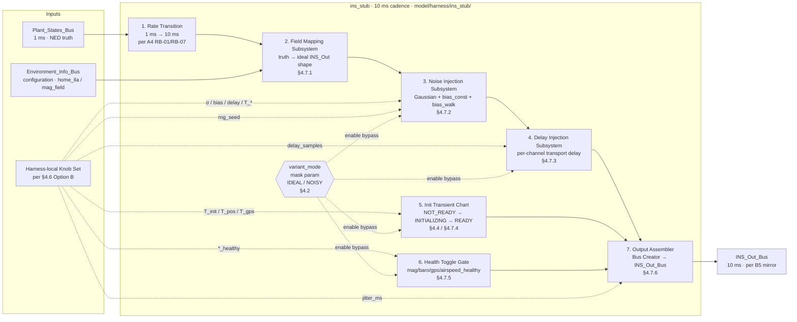

# F2 ins_stub 结构设计(harness-only INS 替身的块级结构、数据流与字段映射)

## 1. 目的

为 [F1 ins_stub 功能设计](F1-ins-stub-functional.md) 锁定的功能契约提供**模型仓侧结构落地**:给出 `model/harness/ins_stub/` 下的**内部块级结构**(顶层子系统拓扑 + 各子块内部信号流)、**数据流**(`Plant_States_Bus → INS_Out_Bus` 全链路)以及**字段级映射表**(每个 `INS_Out_Bus` 字段的 truth 来源、变换、所在块、噪声叠加),并对 F1 显式 defer 给 F2 的四项决策(变体切换载体、knob 载体、RNG sub-seed 派生、init transient 机器结构)做出选择并记入决策日志。本文件**仅**关心结构;**不**重述 F1 的功能行为契约,**不**触及 [F3 INS_Out_Bus 消费规则](F3-consumption-rules.md) 的消费侧 fallback,**不**修改 [B5](../B-contracts/B5-ins-bus-mirror.md) mirror artifact schema。

## 2. 范围

**在范围:**

- §4.1 ins_stub 顶层块结构(Mermaid 拓扑图;输入 / 子块 / 输出 + 各块 rate / Reset 行为)
- §4.2 变体切换机制(F1 §4.1.3 deferred):决策为 mask parameter `variant_mode`,与 Variant Source / Enabled Subsystem 的权衡
- §4.3 **`Plant_States_Bus → INS_Out_Bus` 字段映射表**(F2 主要退出条件)— 覆盖 [B5](../B-contracts/B5-ins-bus-mirror.md) mirror artifact / [B1 §4.3.1](../B-contracts/B1-bus-inventory.md) 全部 10 个字段
- §4.4 Init transient 状态机结构(F1 §4.3.5 timeline 落到 Stateflow 三态 chart)
- §4.5 RNG sub-seed 派生函数(F1 §4.6 deferred):per-channel sub-seed 从 root `rng_seed` 的 deterministic split
- §4.6 Knob carrier(F1 §4.4 deferred):决策为 harness-local Simulink.Parameter set,并对 Option A(PLANT_PARAM)/ Option C(混合)的权衡
- §4.7 各顶层块的内部信号流(field mapping / noise / delay / init transient / health / output assembler 内部结构)
- §4.8 Init/reset 结构落地(per [A6](../A-architecture/A6-init-reset-contract.md) + F1 §4.7)
- §4.9 与 [B5](../B-contracts/B5-ins-bus-mirror.md) mirror artifact 的耦合纪律(单向消费;mirror bump → harness rebuild)
- §4.10 下游交叉引用(F3 / G1 / H 区 / I 区)

**不在范围(由其他工作项处理):**

- ins_stub 的功能行为契约(理想 / 带扰版输出特性、knob shape、validity timeline 数值约束)— 由 [F1](F1-ins-stub-functional.md) 处理,F2 实现 F1
- FMS / Controller 对 `INS_Out_Bus` 字段的消费规则、validity gate、fallback — 由 [F3](F3-consumption-rules.md) 处理(Wave 9)
- `INS_Out_Bus` 字段表 / 类型 / 字节顺序 / `INS_Status` / `INS_Flag` 数值定义 — 由 [B1 §4.3.1](../B-contracts/B1-bus-inventory.md) + [B2 §4.4.10 / §4.4.11](../B-contracts/B2-enum-inventory.md) + [B5 mirror artifact](../B-contracts/B5-ins-bus-mirror.md) 锁定;F2 仅消费
- B5 mirror PR 工作流、抽取脚本、版本标记、drift 检测 — 由 [B5](../B-contracts/B5-ins-bus-mirror.md) + [I2](../I-tooling/I2-bus-enum-mirror.md) + [I3](../I-tooling/I3-contract-diff.md) 处理
- harness 顶层(MIL `.slx`)的 ins_stub 接入拓扑、Pilot_Cmd 注入路径 — 由 [G1 MIL 顶层结构](../G-harness/G1-mil-toplevel.md) / [G4](../G-harness/G4-pilot-injection.md) 处理(Wave 10);F2 只规定 ins_stub block 自身的输入 / 输出 port shape
- H 区故障场景目录、knob 数值矩阵、RNG seed 矩阵管理 — 由 [H1](../H-verification/H1-scenario-catalog.md) / [H3](../H-verification/H3-regression-baseline.md) / [H4](../H-verification/H4-fault-catalog.md) 处理
- I 区 init 脚本、sim runner、contract diff 脚本实现 — 由 I 区处理
- 共享库 `Filters/` / `Validity_Logic/` 等共享块的实现细节 — 由 [A8](../A-architecture/A8-shared-library-roster.md) 锁定;F2 仅声明使用入口
- 多机型 leaf 默认 σ / bias / delay 数值 — 由 [B3 PLANT_PARAM](../B-contracts/B3-parameter-schema.md) 或 harness-local YAML 落地;F2 不锁数值

## 3. 依赖

| 上游 | 引用位置 | 用途 |
|---|---|---|
| 架构 v1 §3 / §10.4 / §11(`model/harness/ins_stub/` 路径)/ §13(INS 10 ms / 100 Hz)/ §15.1 / §17 risk 4 | [链接](../../architecture/2026-05-05-fmt-model-architecture-v1.md) | F2 落地路径(`model/harness/ins_stub/`,§11);ins_stub 是 verification fixture 不在 layer 中(§10.4);cadence 锁定(§13);MIL minimum scope demand(§15.1);risk 4 mitigation 路径(§17)— F2 §4.1 / §4.7 / §4.8 承接 |
| [A1 架构 v1 评审与缺口闭合](../A-architecture/A1-v1-review.md) (status: reviewed, 2026-05-05) | A1 §5 F-04 widening 指派给 F1 / F2 | F2 是 F-04 widening 的结构落地承接者(F1 锁 knob shape,F2 锁 knob 在 Simulink 上的载体形态) |
| [A3 模块边界信号清单细化](../A-architecture/A3-module-boundaries.md) (status: reviewed, 2026-05-07) | A3 §4.3.5(`Plant_States_Bus` 字段表)+ §4.4.4(`INS_Out_Bus` 消费侧字段表)+ §4.8(INS dependency 矩阵) | §4.3 字段映射表的输入侧 / 输出侧字段集来源 |
| [A4 跨速率边界设计](../A-architecture/A4-rate-boundaries.md) (status: reviewed) | A4 §4.4 RB-01(`Plant_States_Bus` 1 ms downsample)+ RB-07(MIL 内部 cadence)+ RB-03 / RB-04(`INS_Out_Bus` 10 ms 下游) | §4.1 / §4.7.1 ins_stub 入口的 1 ms → 10 ms downsample 在 RB-01 / RB-07 框架内,出口 10 ms 与下游 RB-03 / RB-04 对接 |
| [A5 变体策略设计](../A-architecture/A5-variant-strategy.md) (status: reviewed) | A5 总览 + §4.5 harness-only Variant Subsystem | F2 §4.2 决议:ins_stub 自身的 ideal vs noisy 切换**不**经 A5 Variant Subsystem(那是机型 leaf 通道);使用 Simulink Mask Parameter — 与 A5 不冲突 |
| [A6 Init/Reset 状态契约](../A-architecture/A6-init-reset-contract.md) (status: reviewed, 2026-05-05) | A6 §4.2.2(init 中禁 RNG)+ §4.3.1(reset 触发源)+ §4.4.2(消费侧默认稳态)+ §4.5.3(INS 协调协议)+ §4.7.1(MIL 非对称项行 ins_stub 必须模拟 INS_Status / INS_Flag 位域)| §4.4 init transient chart 的 reset 入口与 §4.5 RNG sub-seed 在 init 之外的派生策略(满足 A6 §4.2.2 "init 中禁 RNG" 约束 — 状态在 step 内由 deterministic 派生而非 init 调 RNG)|
| [A7 时间与时间戳约定](../A-architecture/A7-time-conventions.md) (status: reviewed, 2026-05-05) | A7 §4.1(uint32 ms)+ §4.2(zero-from-boot)+ §4.3(wrap)+ §4.4(单调) | §4.3 表 `timestamp` 行;§4.7.6 timestamp 生成块 |
| [A8 共享库块清单与归属](../A-architecture/A8-shared-library-roster.md) (status: reviewed) | A8(共享库块 — 例如 Gaussian noise generator、`Validity_AND`、quaternion 工具) | F2 §4.7.2 / §4.7.4 / §4.7.5 引用共享库块作为子块的实现入口 — F2 **不**自定义新块,优先消费共享库 |
| [B1 Bus 清单与 schema 设计](../B-contracts/B1-bus-inventory.md) (status: reviewed, 2026-05-07) | B1 §4.3.1(`INS_Out_Bus` 10 字段)+ §4.5.1(`Plant_States_Bus` 字段表)+ §4.6.5 / §4.6.6(`INS_Status` / `INS_Flag` 子 schema)| §4.3 字段映射表的两端字段集与字段顺序 |
| [B2 Enum 清单与数值锁定](../B-contracts/B2-enum-inventory.md) (status: reviewed) | B2 §4.4.10 `INS_Status` 值表 + §4.4.11 `INS_Flag` 位号表 | §4.4 init transient chart 的输出值定义来源(F2 不重述,只引用) |
| [B5 INS_Out_Bus 镜像同步流程](../B-contracts/B5-ins-bus-mirror.md) (status: reviewed, 2026-05-07) | B5 §4.5(mirror artifact `model/shared/bus/ins/INS_Out_Bus.yaml` 存放)+ §4.8(F-area 下游耦合 — F1 / F2 / F3 输出 bus 必须按本镜像产物字段顺序 / 类型 / unit / frame 输出,不得改 / 加 / 减字段)| §4.3 字段表 schema 真理来源;§4.9 单向消费纪律 |
| [F1 ins_stub 功能设计](F1-ins-stub-functional.md) (status: reviewed, 2026-05-08) | F1 §4.1.3(变体集合,deferred to F2 决定切换载体)+ §4.2 / §4.3(理想 / 带扰输出行为)+ §4.3.5(transient timeline)+ §4.4(13 类 knob shape;§4.4.1 表)+ §4.5(消费侧字段映射 — F1 已给 truth source 与 transform 列)+ §4.6(RNG seeding 契约,deferred to F2 sub-seed 函数)+ §4.7(init/reset 行为) | F2 是 F1 的结构实现 — F1 lockd 行为,F2 lockd 块拓扑;§4.3 字段映射表是 F1 §4.5 的结构化展开 |
| [C1 Plant 功能设计](../C-plant/C1-plant-functional.md) *(reviewed 2026-05-08,per task brief upstream snapshot)* | C1 sensor synthesis + Plant_States_Bus truth 输出能力 | §4.3 字段表对 `Plant_States_Bus` 字段的引用以 [A3 §4.3.5](../A-architecture/A3-module-boundaries.md) 字段表为权威(已 reviewed),C1 仅作 cross-cite 注释;ins_stub **不**消费 C1 的 sensor synthesis bus(走 truth 捷径) |
| firmware INS 头文件 | `FMT-Firmware/src/model/ins/<variant>/lib/INS_types.h` @ `FMT-Firmware @ <pending hash>`(commit hash 在 INDEX 决策日志登记本工作项时补齐,与 [A3 §3](../A-architecture/A3-module-boundaries.md) / [A6 §3](../A-architecture/A6-init-reset-contract.md) / [A7 §3](../A-architecture/A7-time-conventions.md) / [B1 §3](../B-contracts/B1-bus-inventory.md) / [B2 §3](../B-contracts/B2-enum-inventory.md) / [B5 §3](../B-contracts/B5-ins-bus-mirror.md) / [F1 §3](F1-ins-stub-functional.md) 同 batch 占位约定;FMT-Firmware 仓未挂载在本环境)| F2 **不**直接读 firmware,只通过 [B5](../B-contracts/B5-ins-bus-mirror.md) mirror artifact 间接消费 schema |

注:本工作项 contract_impact=**no**。F2 是 harness-only fixture 的结构设计;**不**触及 firmware 可见 bus / enum / parameter / EXPORT 任一契约面 — `INS_Out_Bus` schema 由 [B1 §4.3.1](../B-contracts/B1-bus-inventory.md) + [B5 mirror artifact](../B-contracts/B5-ins-bus-mirror.md) 锁定(那两个文档 contract_impact=yes);F2 只是镜像产物的**结构消费方**,ins_stub 自身永不导出 firmware(per F1 §4.1.2 + 架构 v1 §10.4 / §17 risk 4 mitigation)。

## 4. 设计内容

### 4.1 ins_stub 顶层块结构

#### 4.1.1 拓扑图(Mermaid)



#### 4.1.2 块清单(各块 rate 与 Reset 行为)

| # | 块 | Rate | Reset 行为(per [A6](../A-architecture/A6-init-reset-contract.md) + F1 §4.7)|
|---|---|---|---|
| 1 | Rate Transition (1 ms → 10 ms) | 输入 1 ms,输出 10 ms | 无内部 state(纯 sample-time-based downsample);reset 即 pass-through |
| 2 | Field Mapping Subsystem | 10 ms | 无 dynamic state(纯算子);reset 立即 sync 到 `Plant_States_Bus` truth |
| 3 | Noise Injection Subsystem | 10 ms | RNG sub-seed 状态 / `bias_walk` 累加器 → reset 时按 §4.5 / §4.8 重新派生(deterministic); `bias_const` 来自 knob,reset 时回读 |
| 4 | Delay Injection Subsystem | 10 ms | 每通道 ring-buffer 清空(填 0 或 NaN,由 IDEAL 退化时 pass-through 保证 byte-equal,§4.7.3.3)|
| 5 | Init Transient Chart | 10 ms | reset 时进入 `NOT_READY`(per §4.4);timer 归零;按 §4.4 timeline 重启 |
| 6 | Health Toggle Gate | 10 ms | bool knob 读取(scenario 注入);reset 时回到默认 "all healthy"(per F1 §4.4.1 表 HARDCODED true 列)|
| 7 | Output Assembler (Bus Creator) | 10 ms | 无 state(纯 Bus Creator);reset 即按当前输入重新 assemble |

#### 4.1.3 Cadence 与 [A4](../A-architecture/A4-rate-boundaries.md) 边界

- **入口 RB-01 / RB-07**:`Plant_States_Bus` 1 ms 进入 ins_stub 时,块 1(Rate Transition)做 sample-time-based downsample 到 10 ms — 与 A4 §4.4 RB-01 在 ins_stub 内部退化为 RB-07(harness 内部固定 cadence)的语义对齐。
- **内部**:块 2..7 全部 10 ms 单 rate(per F1 §4.1.4 cadence 锁 100 Hz)。
- **出口 RB-03 / RB-04**:`INS_Out_Bus` 10 ms 输出由 harness 顶层(G1)路由到 Controller(5 ms,经 RB-03 ZOH)与 FMS(20 ms,经 RB-04 downsample);**ins_stub 不自带这些下游 rate transition**,只发布 10 ms 信号。

#### 4.1.4 路径

ins_stub 落地路径 = `model/harness/ins_stub/`(per 架构 v1 §6 / §11 directory tree;F1 §4.1.2 boundary table);具体子文件命名规范由 [A2](../A-architecture/A2-naming-conventions.md) 与 [G1](../G-harness/G1-mil-toplevel.md) 决定(F2 不锁文件名,只锁逻辑结构)。

### 4.2 变体切换机制(F1 §4.1.3 deferred 决策)

#### 4.2.1 三选项权衡

| 选项 | 描述 | 优 | 劣 |
|---|---|---|---|
| **A · Mask Parameter `variant_mode`** | 在 ins_stub 顶层子系统的 mask 上暴露 enum `variant_mode ∈ {IDEAL, NOISY}`;通过 enabled-block / variant subsystem in-place 选择 noise/delay/transient 子块是否启用(传递 enable 信号或封装常量分支) | 最简;变体在 scenario 启动时由 harness-local YAML / Simulink.Parameter 设置;无运行时切换;实现仅需一个 mask + 几个 `Switch` 块或 `Variant Source`;与 [A5](../A-architecture/A5-variant-strategy.md) Variant Subsystem 解耦(A5 服务于机型 leaf,不污染本 mask)| 切换是 build-time 而非运行时 — 但 F1 §4.1.3 显式声明"变体在 scenario 启动时选择",符合需求 |
| **B · A5 Variant Source 块** | 用 [A5](../A-architecture/A5-variant-strategy.md) Variant Source 包两个版本的 ins_stub | 与机型 leaf 选择机制统一 | 与 A5 §4.5 设计意图冲突(A5 服务机型 leaf,不应混入 fixture 切换);引入 Variant Configuration 维护负担;`ideal` / `noisy` 不是 A5 意义上的 variant control(机型 / phase) |
| **C · Enabled Subsystem + Switch** | noise/delay/transient 子块全部包成 enabled subsystem,`enable` 信号由 mask param 决定 | 灵活;可运行时切换 | F1 §4.1.3 不需要运行时切换;过度设计;`enable=0` 期间 enabled subsystem 内部 state 处置(hold vs reset)需另设规则 |

#### 4.2.2 决策:**Option A — Mask Parameter `variant_mode`**

ins_stub 顶层子系统暴露 mask parameter:

```text
variant_mode : enum {IDEAL, NOISY}        % default IDEAL
```

实现机制:
- `IDEAL` 时,块 3(Noise Injection)/ 块 4(Delay Injection)/ 块 5(Init Transient) 退化为 pass-through(noise / delay 通道恒等;init transient 立即输出 `INS_STATUS_READY` + 全 valid 位);块 6(Health Gate)忽略 `*_healthy` 输入,强制 valid 全置 1。
- `NOISY` 时,所有子块按 F1 §4.3 行为运行。
- 退化由 `variant_mode == IDEAL` 信号在每子块入口的 `Switch` 或 `Variant Source` 二选一实现 — 具体载体在子块内部由 §4.7 节决定。

**为什么这是正确选择**:
1. F1 §4.1.3 明文 "变体在 harness 层通过参数二选一" — Option A 是最朴素实现。
2. F1 §4.4.2 要求 "knob 默认值导致退化为理想版的(σ=0、bias=0、delay=0、health=true、T_*_ms=0)的组合,行为必须 byte-equal 于 §4.2 理想版" — Option A 通过显式 `variant_mode=IDEAL` 强制 bypass,比"靠 knob 全 0"更稳健(消除浮点尾巴)。
3. **场景脚本只需设 `variant_mode`,不必逐 knob 清零** — H1 / H4 场景表设计(Wave 11)更简洁。

#### 4.2.3 与 [A5](../A-architecture/A5-variant-strategy.md) 的边界

A5 Variant Subsystem 服务于机型 leaf(multicopter / fixwing / VTOL)与 phase 路线,与 `variant_mode` 是**正交**维度:
- `variant_mode` 是 ins_stub fixture 自身的 ideal / noisy 选择(harness 维度)
- 机型 leaf 的多旋翼 vs 固定翼是 A5 维度(模型仓 leaf 维度)

F2 不在 ins_stub 内嵌入机型 leaf variant — `airspeed_*` 字段在 multicopter Phase 2 永远 N/A(per F1 §4.2.2 表),由块 6 / 块 7 通过 `airspeed_healthy=false` + 字段固定 0 的方式处理(§4.7.6),**不**走 A5 机型 leaf 通道。

### 4.3 `Plant_States_Bus → INS_Out_Bus` 字段映射表(F2 主要退出条件)

本表覆盖 [B5 mirror artifact](../B-contracts/B5-ins-bus-mirror.md)(以及 [B1 §4.3.1](../B-contracts/B1-bus-inventory.md) 消费侧 best-effort)枚举的全部 10 个字段。**字段名 / 类型 / 顺序 / 字节宽度以 [B5](../B-contracts/B5-ins-bus-mirror.md) mirror artifact `INS_Out_Bus.yaml` 为权威**;F2 仅锁定**生产侧的块拓扑与变换语义**。

#### 4.3.1 主表

| # | `INS_Out_Bus` 字段(per B1 §4.3.1)| 来源(`Plant_States_Bus` per [A3 §4.3.5](../A-architecture/A3-module-boundaries.md) / [B1 §4.5.1](../B-contracts/B1-bus-inventory.md)) | 变换 | 生产块(§4.7) | NOISY 叠加(per F1 §4.3 / §4.4)|
|--:|---|---|---|---|---|
| 1 | `position_lla` (`double[3]`,lat_deg / lon_deg / alt_m) | `pos_ned_m[3]` + `Environment_Info_Bus.home_lla[3]`(per [A3 §4.3.3](../A-architecture/A3-module-boundaries.md) Plant 输入 → harness 回读为 `home_lla`)| **NED → LLA**(WGS-84 平面近似,per [A8](../A-architecture/A8-shared-library-roster.md) 共享 `NED2LLA` 块若可用,否则 inline)+ `single → double` cast | 块 2(Field Mapping)→ 块 3(Noise) | + σ_noise[position_lla] + bias[position_lla] + delay[position_lla];`gps_healthy=false` 时 LLA → 0(F2 选 0,per §4.4 / §5)|
| 2 | `position_ned_m` (`single[3]`)| `pos_ned_m[3]` | identity(类型同 single,坐标系同 NED)| 块 2 → 块 3 → 块 4 | + σ_noise[pos_ned] + bias[pos_ned] + delay[pos_ned] |
| 3 | `velocity_ned_mps` (`single[3]`)| `vel_ned_mps[3]` | identity | 块 2 → 块 3 → 块 4 | + σ_noise[vel_ned] + bias[vel_ned] + delay[vel_ned] |
| 4 | `quat_ned_to_b` (`single[4]`,w-first 占位 per B1 §4.3.1)| `quat_ned_to_b[4]` | identity(quaternion 已 NED→body)+ post-noise normalize(单位长度约束;per F1 §4.5 表 quat 行)| 块 2 → 块 3(noise + normalize)→ 块 4 | + σ_noise[quat] + delay[quat](**无** bias_const[quat] — F1 §4.5 表锁:bias 在 quaternion 上不直接有意义)|
| 5 | `euler_ned_to_b_rad` (`single[3]`,ZYX yaw / pitch / roll)| `euler_ned_to_b_rad[3]` *(若 Plant 输出)* 或 quat → euler 派生 | 优先 identity from `Plant_States_Bus.euler_ned_to_b_rad`(per [A3 §4.3.5](../A-architecture/A3-module-boundaries.md) Plant 输出表行 6);若 Plant 不 ship,则块 2 内置 `quat2eul(ZYX)` 转换 | 块 2 → 块 3 → 块 4 | + σ_noise[euler] + bias[euler] + delay[euler] |
| 6 | `ang_rate_b_radps` (`single[3]`,body) | `ang_rate_b_radps[3]` | identity(body 系已对齐) | 块 2 → 块 3 → 块 4 | + σ_noise[ang_rate] + bias[ang_rate] + delay[ang_rate] |
| 7 | `acc_b_mps2` (`single[3]`,body specific force)| `acc_b_mps2[3]` | identity | 块 2 → 块 3 → 块 4 | + σ_noise[acc] + bias[acc] + delay[acc] |
| 8 | `INS_Status` (`uint32` bitfield / enum per [B2 §4.4.10](../B-contracts/B2-enum-inventory.md)) | N/A(stub-internal state machine output)| 块 5 输出枚举值;块 6 health gate 在严重失效时降级到 DEGRADED / FAULT(per F1 §4.3.8)| 块 5 → 块 6 → 块 7 | NOISY 模式下走 transient timeline(NOT_READY → INITIALIZING → READY,per F1 §4.3.5)|
| 9 | `INS_Flag` (`uint32` bitfield per [B2 §4.4.11](../B-contracts/B2-enum-inventory.md)) | N/A(stub-internal state)| 块 5 chart bitfield 输出 + 块 6 health 强制清零;F2 §4.4 / §4.7.4 | 块 5 → 块 6 → 块 7 | per F1 §4.3.5 timeline 各位逐 step 置位;health knob 强制清零 |
| 10 | `timestamp` (`uint32` ms per [A7](../A-architecture/A7-time-conventions.md)) | N/A(由 ins_stub 自身 step 触发时刻派生,per F1 §4.2.3)| 块 7 内 `Digital Clock(SampleTime=10ms)` 取整 ms → uint32 cast(zero-from-boot,严格单调)| 块 7 | + jitter_ms(per F1 §4.3.6;jitter 由 sub-seed `S_jitter` 派生;**只**改 timestamp 字段值,不改 Simulink sample hit 时刻)|

#### 4.3.2 派生通道说明(per F1 §4.5.1)

ins_stub **不**消费 Plant 的 `IMU_Bus` / `MAG_Bus` / `Barometer_Bus` / `GPS_uBlox_Bus` / `AirSpeed_Bus`(那些是 [C1](../C-plant/C1-plant-functional.md) sensor synthesis 输出供 firmware INS 真实驱动用;ins_stub 走 truth 捷径)。`INS_Out_Bus` 中:
- `position_lla` 由 ins_stub 由 `Plant_States_Bus.pos_ned_m` + `Environment_Info_Bus.home_lla` 直接派生(块 2);**不**经 GPS bus
- mag / baro / airspeed 在 firmware INS_Out_Bus 中通常**不直接呈现为 navigation 字段** — 它们是 firmware 估计器内部融合的输入;ins_stub 仅通过 `INS_Flag.mag_valid` / `baro_valid` / `gps_valid` / `airspeed_valid` 位与 `INS_Status` 的 DEGRADED 等级体现"健康度"(块 6),不输出独立 mag / baro / airspeed navigation 字段

若 [B5](../B-contracts/B5-ins-bus-mirror.md) mirror artifact 首次落地后揭示 firmware 实际含独立 mag / baro / airspeed navigation 字段,F2 通过变更日志补行(块 2 加派生分支:mag 从 quat + `Environment_Info_Bus.mag_field_ned_gauss` 派生;baro 从 `pos_ned_m[2]` + 大气模型派生;airspeed 由 `vel_ned_mps` 在 fixed-wing variant 派生)。

#### 4.3.3 Self-consistency check(per [A6 §4.4.3](../A-architecture/A6-init-reset-contract.md))

A6 §4.4.3 要求 init 后 Plant 输出与 ins_stub 输出 self-consistent。F2 §4.3.1 表的 identity / NED→LLA 关系**自然满足**:`variant_mode=IDEAL` 时,块 2(Field Mapping)输出在 single 精度下 byte-equal 于 `Plant_States_Bus` truth(NED→LLA 转换有 single→double cast 但 LLA 值由 `pos_ned_m` 与 `home_lla` 唯一决定 — deterministic)。

### 4.4 Init transient 状态机结构(F1 §4.3.5 deferred to F2)

#### 4.4.1 Stateflow chart 三态定义

块 5(Init Transient)以**单个 Stateflow chart** 实现 F1 §4.3.5 timeline:

```text
Inputs to chart:
  - sim_time_ms   : uint32     % 仿真时钟,zero-from-boot
  - T_init_ms     : uint32     % knob (per F1 §4.4.1; default 0 in IDEAL, 200..500 typical NOISY)
  - T_pos_lock_ms : uint32     % knob (default 0 in IDEAL, 1000..3000 typical NOISY)
  - T_gps_lock_ms : uint32     % knob (default 0 in IDEAL, 5000..30000 typical NOISY)
  - variant_mode  : enum       % IDEAL / NOISY (per §4.2)

Outputs from chart:
  - status      : INS_Status enum   % per B2 §4.4.10
  - flag        : uint32 bitfield   % per B2 §4.4.11; bit positions = B2 alias
```

```text
            ┌─────────────────────────────────────────────────────────────┐
            │                                                             │
            ▼                                                             │
    ┌──────────────┐  variant_mode==IDEAL                ┌───────────────┐
    │  S0          │  || sim_time_ms >= T_init_ms        │  S2           │
    │  NOT_READY   │ ─────────────────────────────────► │  READY         │
    │  status =    │                                     │  status =     │
    │   NOT_READY  │  variant_mode==NOISY &&             │   READY       │
    │  flag = 0    │   sim_time_ms >= T_init_ms          │  flag = full  │
    └──────────────┘ ─────► ┌──────────────┐ ──────────► └───────────────┘
                            │  S1          │
                            │  INITIALIZING│  during S1:
                            │  status =    │  - bit attitude_valid=1 on entry
                            │   INIT       │  - bit heading_valid=1 on entry
                            │  flag = ...  │  - bit velocity_valid=1 on entry
                            └──────────────┘  - bit position_valid=1 when sim_time_ms >= T_pos_lock_ms
                                              - bit baro_valid=1 when sim_time_ms >= T_pos_lock_ms
                                              - bit mag_valid=1 when sim_time_ms >= T_pos_lock_ms
                                              - bit gps_valid=1 when sim_time_ms >= T_gps_lock_ms
                                              transition S1 → S2 fires when all required bits set
                                              (gps_valid is the last to flip)
```

#### 4.4.2 Per-bit 时序(承接 F1 §4.3.5)

| Bit(per [B2 §4.4.11](../B-contracts/B2-enum-inventory.md))| IDEAL | NOISY · 起始为 1 的时刻 |
|---|---|---|
| `attitude_valid` | t=0(立即)| `sim_time_ms ≥ T_init_ms` |
| `heading_valid` | t=0 | `sim_time_ms ≥ T_init_ms` |
| `velocity_valid` | t=0 | `sim_time_ms ≥ T_init_ms`(body-frame from IMU integration,F1 §4.3.5)|
| `position_valid` | t=0 | `sim_time_ms ≥ T_pos_lock_ms` |
| `baro_valid` | t=0 | `sim_time_ms ≥ T_pos_lock_ms`(per F1 §4.3.5 timeline)|
| `mag_valid` | t=0 | `sim_time_ms ≥ T_pos_lock_ms` |
| `gps_valid` | t=0 | `sim_time_ms ≥ T_gps_lock_ms`(最后一个 flip)|
| `airspeed_valid` | 1(fixed-wing variant)/ 0(multicopter Phase 2)| 同 IDEAL — 由 §4.3 表 / 块 6 决定 |
| `vel_body_valid`(若 firmware mirror 含此位)| 1 | 1(per F1 §4.2.2 / §4.3.5;实际 firmware 有 IMU integration 后立即 valid)|

进入 `S2 (READY)` 触发条件 = `(attitude_valid & velocity_valid & position_valid & gps_valid) == 1` — 即全部 navigation 关键位 ready 且 GPS 已 lock。

#### 4.4.3 Reset 行为

- TS-MIL-HARNESS reset(per [A6 §4.3.1](../A-architecture/A6-init-reset-contract.md))→ chart 重新进入 `S0 (NOT_READY)`,timer 归零,bitfield 清零;按 §4.4.1 / §4.4.2 timeline 重新启动
- TS-FMS-OUT / TS-FAILSAFE / TS-EXT-CMD / TS-MODE-XCHG reset → chart **不响应**(per F1 §4.7.2 表 — ins_stub 模拟 firmware-owned INS,后者不被 FMS reset 联动)
- Health knob 中途切换为 false → chart 不进入 reset,但块 6 在出口对相应 `flag.<x>_valid` 位强制清零 + 视场景把 `INS_Status` 降级到 DEGRADED(per F1 §4.3.8)

#### 4.4.4 实现替代(若不用 Stateflow)

若实施时不希望引入 Stateflow,可用三个 `Compare To Constant` + `Bitwise OR` 拼装等价逻辑(每位的"flip 时刻"由独立的 `sim_time_ms ≥ T_*` 比较器输出);F2 锁定语义(三态 chart 的等价行为)而**不**强制具体 Simulink 块选择。Stateflow 是首选(可读性、状态可观测性更好);Compare 拼装是备选(若 G3 logging 偏好简单信号)。

### 4.5 RNG sub-seed 派生函数(F1 §4.6 deferred to F2)

#### 4.5.1 设计目标

满足 F1 §4.6 的三项承诺:
1. ins_stub **不**在 init 中调用 RNG(per [A6 §4.2.2](../A-architecture/A6-init-reset-contract.md))
2. 多 noise / walk / jitter 通道独立 sub-seed,避免 cross-channel 相关
3. 给定相同 root `rng_seed` + 相同 scenario timeline,产生 byte-equal noise 序列

#### 4.5.2 通道清单与 channel ID

每个独立 noise 流分配一个稳定整数 channel ID(F2 锁定;**永不**重排,以保证跨版本 H3 baseline 可比):

| Channel ID | 通道用途 |
|---:|---|
| 0 | `pos_ned` 高斯白噪声 |
| 1 | `vel_ned` 高斯白噪声 |
| 2 | `quat` 高斯白噪声(post-normalize) |
| 3 | `ang_rate` 高斯白噪声 |
| 4 | `acc_b` 高斯白噪声 |
| 5 | `bias_walk` 累加器(全字段共享一个 walk 流并按 per-field 缩放,或 per-field 各一个;F2 选 **per-field 各一**,channel ID 见 §4.5.3 表)|
| 6 | `gps_jitter` / GPS lock 抖动 |
| 7 | `mag_noise`(若 mag-derived 字段加入,§4.3.2 mirror-artifact-conditional;Phase 2 reserved)|
| 8 | `baro_noise`(同上 reserved;若 mirror 加 baro 字段后启用)|

#### 4.5.3 bias_walk 子通道(避免与 channel 5 polysemy)

由于 7 个 navigation 字段每个都有独立的 `bias_walk` 累加器,采用**子 channel ID** 派生(在 channel 5 base 上展开):

| Sub-Channel ID | 用途 |
|---:|---|
| 5_0 | `bias_walk[pos_ned]` |
| 5_1 | `bias_walk[vel_ned]` |
| 5_2 | `bias_walk[euler]`(quat 不带 bias_const / bias_walk per F1 §4.5)|
| 5_3 | `bias_walk[ang_rate]` |
| 5_4 | `bias_walk[acc_b]` |
| 5_5 | `bias_walk[position_lla]` |

#### 4.5.4 派生函数

F2 锁定:

```text
sub_seed(channel_id) = uint32(  uint64(rng_seed)
                              ⊕ uint64(channel_id) * 0x9E3779B97F4A7C15
                              ⊕ rotl64(uint64(rng_seed), channel_id mod 13)
                             ) mod 2^32
```

其中 `0x9E3779B97F4A7C15` 是 64-bit golden-ratio 乘数(splitmix64 / xxHash64 常用 mixing constant),`rotl64` 是 64-bit 左旋。该形式具备:
- **deterministic**:同一 (`rng_seed`, `channel_id`) → 同一 `sub_seed` byte-equal
- **avalanche**:相邻 channel ID 派生的 sub-seed 在 bit 层面充分散开(消除 cross-channel correlation)
- **不依赖 RNG 初始化**:派生本身是纯算术函数,不调 RNG —— 满足 [A6 §4.2.2](../A-architecture/A6-init-reset-contract.md) "init 中禁 RNG"
- **可在 Simulink MATLAB Function 块内 inline 实现**(纯 uint64 算术,Embedded Coder 兼容 — 但 F2 不要求 codegen,因 ins_stub harness-only)

子通道(§4.5.3 形式 `5_k`)派生:

```text
sub_seed(5, k) = sub_seed( hash_compose(5, k) )
              = uint32(  uint64(rng_seed)
                       ⊕ uint64(5*256 + k) * 0x9E3779B97F4A7C15
                       ⊕ rotl64(uint64(rng_seed), (5*256 + k) mod 13)
                      ) mod 2^32
```

(即把 `5_k` 编码为 `5*256 + k` 后走主公式)。

#### 4.5.5 Determinism guarantee

- 给定 (root `rng_seed`, scenario timeline, `variant_mode`, knob set, mirror artifact schema_version),ins_stub 在 NOISY 模式下产生**byte-equal** `INS_Out_Bus` 序列 — 这是 [F1 §4.6.2](F1-ins-stub-functional.md) 的 deterministic 复现承诺的结构落地
- IDEAL 模式 noise 流根本不被使用(Switch bypass),因此不依赖 sub-seed — IDEAL 与 NOISY 之间通过 `variant_mode` 切换不影响 byte-equal(IDEAL 永远 byte-equal,NOISY 在同 seed 下 byte-equal)

#### 4.5.6 Forward-cite [H3](../H-verification/H3-regression-baseline.md)(Wave 11)

H3 会落:
- Root seed 从 scenario YAML / CLI 注入 ins_stub workspace 的具体路径
- 批量回归种子矩阵(per-scenario 多 seed,covariance estimation)
- baseline `.mat` 中如何固化 root seed

F2 承接义务:**§4.5.4 派生函数与 §4.5.2 / §4.5.3 channel ID 表是 H3 之上的稳定接口** — H3 只决定 root seed 怎么注入,channel ID 与派生函数永远由 F2 锁定。若 H3 决定使用更复杂的 seed 集合(per-channel 独立 root seed array),F2 §4.5 通过变更日志扩展(增加 "explicit per-channel seed override" 旁路;但默认仍走派生函数)。

### 4.6 Knob carrier(F1 §4.4 deferred to F2)

#### 4.6.1 三选项权衡

F1 §4.4.1 锁定 13 类 knob shape(per-field 展开后总 knob 数 ≥ 50;F1 §5 风险列出"PARAM 表膨胀风险")。F2 决定 knob 在 Simulink 上的存储载体。

| 选项 | 描述 | 优 | 劣 |
|---|---|---|---|
| **A · 全部入 PLANT_PARAM** | knob 全部追加到 [B3 PLANT_PARAM](../B-contracts/B3-parameter-schema.md) 的 schema | CI-tunable;与 vehicle param 同流;PLANT_PARAM CI 工具复用 | PLANT_PARAM 字节宽度增大 ≥ 50 字段;**ins_stub 是 harness-only,不该污染 PLANT_PARAM**(PLANT_PARAM 是 vehicle 配置参数);触发 B3 schema 修订(已 reviewed → 重新评审) |
| **B · 全部入 harness-local Simulink.Parameter set** | knob 在 `model/harness/ins_stub/params/` 下定义为独立 Simulink.Parameter struct(通过 init 脚本加载到 base workspace);ins_stub mask 直接引用 `ins_stub_knobs.<name>` | PLANT_PARAM 不受影响;harness-local 知识不外泄;scenario YAML 直接覆盖 struct 字段;不触发 B3 修订 | knob 不在 firmware-side 工具链中;若未来 SIH 阶段需要某些 knob 与真实 INS 对齐,需手动迁移 |
| **C · 混合(`variant_mode` + `rng_seed` 入 PLANT_PARAM,其余 harness-local)** | scenario-level 顶级旋钮入 PLANT_PARAM;per-channel σ / bias / delay 留 harness-local | 顶级 knob 与 vehicle param 同流;per-channel 细节不污染 PLANT_PARAM | 仍触发 B3 一次小修(加 2 字段);**`variant_mode` 与 `rng_seed` 也是 harness 知识,放 PLANT_PARAM 同样不当**;混合带来"哪些 knob 在哪"的认知负担 |

#### 4.6.2 决策:**Option B — harness-local Simulink.Parameter set**

所有 ins_stub knob(F1 §4.4.1 表 13 类全部)放在 `model/harness/ins_stub/params/ins_stub_knobs.m`(由 [I1 init 脚本](../I-tooling/I1-init-script.md) 在 base workspace 装载),作为单一 Simulink.Parameter struct `ins_stub_knobs`,字段路径建议(per F1 §4.4.3):

```text
ins_stub_knobs.variant_mode                 % enum {IDEAL, NOISY}
ins_stub_knobs.rng_seed                     % uint32
ins_stub_knobs.t_init_ms                    % uint32
ins_stub_knobs.t_pos_lock_ms                % uint32
ins_stub_knobs.t_gps_lock_ms                % uint32
ins_stub_knobs.jitter_ms                    % single
ins_stub_knobs.mag_healthy                  % logical
ins_stub_knobs.baro_healthy                 % logical
ins_stub_knobs.gps_healthy                  % logical
ins_stub_knobs.airspeed_healthy             % logical
ins_stub_knobs.sigma_noise.pos_ned_m        % single[3]
ins_stub_knobs.sigma_noise.vel_ned_mps      % single[3]
ins_stub_knobs.sigma_noise.quat             % single[4]
ins_stub_knobs.sigma_noise.euler_rad        % single[3]
ins_stub_knobs.sigma_noise.ang_rate_radps   % single[3]
ins_stub_knobs.sigma_noise.acc_mps2         % single[3]
ins_stub_knobs.sigma_noise.position_lla     % single[3]   % deg / deg / m
ins_stub_knobs.bias_const.<field>           % per-field same shape (excl. quat)
ins_stub_knobs.sigma_walk.<field>           % per-field
ins_stub_knobs.delay_samples.<field>        % per-field uint8
```

#### 4.6.3 为什么 Option B 是正确选择

1. ins_stub 是 **harness-only**(F1 §4.1.2 / 架构 v1 §10.4);knob 不该入 firmware-visible PLANT_PARAM
2. F1 §5 "knob 数量增长导致 PARAM 表膨胀风险" 已建议 harness-local —— F2 承接此建议
3. PLANT_PARAM([B3](../B-contracts/B3-parameter-schema.md))已 reviewed;Option A / C 均触发 B3 修订(增量评审成本 + INDEX 决策日志登记)
4. scenario YAML([H1](../H-verification/H1-scenario-catalog.md)/[H4](../H-verification/H4-fault-catalog.md)) 在加载场景时由 [I1 init 脚本](../I-tooling/I1-init-script.md) 用字段级 override 修改 `ins_stub_knobs` — 路径短、不需要绕道 PLANT_PARAM

#### 4.6.4 不触发 B3 修订

由于本决策选 Option B,**不**修改 B3 PLANT_PARAM schema — F2 contract_impact 仍为 **no**(harness-local Simulink.Parameter 不入 firmware 契约面;不触发 B4 / I3 contract diff)。F2 §7 下游影响表列 B3 = "no impact"。

#### 4.6.5 Knob 默认值

F2 不锁数值,但锁**默认行为类别**(per F1 §4.4.1 表):
- `variant_mode = IDEAL`
- `rng_seed`:**无默认**(scenario 必须显式提供;F2 init 脚本若发现 `rng_seed` 未注入则 hard-fail,与 F1 §5 非阻塞建议 (c) "CI 拒收无种子的场景"对齐)
- `t_init_ms = 0`,`t_pos_lock_ms = 0`,`t_gps_lock_ms = 0`,`jitter_ms = 0`(IDEAL 退化)
- `*_healthy = true`
- 全部 `sigma_noise.<field> = 0`,`bias_const.<field> = 0`,`sigma_walk.<field> = 0`,`delay_samples.<field> = 0`(IDEAL 退化)

NOISY 场景(H1 noisy stress / H4 故障注入)在 scenario YAML 中显式覆盖。

### 4.7 各顶层块的内部信号流

本节给 §4.1.1 拓扑图中各块的**内部结构**;不锁具体 Simulink 块名(F2 锁拓扑,具体块由实施阶段选)。

#### 4.7.1 块 2 · Field Mapping Subsystem

- **输入**:`Plant_States_Bus`(已经过块 1 downsample 到 10 ms)、`Environment_Info_Bus.home_lla[3]` / `mag_field_ned_gauss[3]`(后者 reserved,§4.3.2 mirror-artifact-conditional)
- **结构**:`Bus Selector` → 每个 navigation 字段独立分支:
  - `pos_ned_m` → identity → `signal_pos_ned`
  - `vel_ned_mps` → identity → `signal_vel_ned`
  - `quat_ned_to_b` → identity → `signal_quat`
  - `euler_ned_to_b_rad`(若 Plant ship)→ identity / 否则 `quat → quat2eul(ZYX)` 共享库块([A8](../A-architecture/A8-shared-library-roster.md) `Quaternion/Quat2Eul`)→ `signal_euler`
  - `ang_rate_b_radps` → identity → `signal_ang_rate`
  - `acc_b_mps2` → identity → `signal_acc`
  - `pos_ned_m` + `home_lla` → `NED2LLA` 共享库块(若 [A8](../A-architecture/A8-shared-library-roster.md) ship,否则 inline WGS-84 平面近似:`lat = home_lat + pos_ned[0] / R_earth`,`lon = home_lon + pos_ned[1] / (R_earth · cos(lat))`,`alt = home_alt - pos_ned[2]`)+ `single → double` cast → `signal_pos_lla`
- **输出**:7 个 ideal navigation signal(`signal_*`)流入块 3(Noise Injection)

#### 4.7.2 块 3 · Noise Injection Subsystem

- **输入**:7 个 ideal `signal_*` + `ins_stub_knobs.sigma_noise.*` / `bias_const.*` / `sigma_walk.*` / `rng_seed` + `variant_mode`
- **结构(per channel,以 `pos_ned` 为例)**:
  ```text
  signal_pos_ned ──────────────► (+) ──────────────► signal_pos_ned_noisy
                                  ▲ ▲ ▲
                                  │ │ │
   N(0, σ_noise.pos_ned_m)  ──────┘ │ │   ← seeded RNG (sub_seed(0)) per channel ID 0
   bias_const.pos_ned_m  ───────────┘ │   ← scalar from knob
   bias_walk[pos_ned]    ─────────────┘   ← integrator over N(0, σ_walk.pos_ned_m × √dt_s)
                                              with sub_seed(5_0) per §4.5.3
  ```
  - Gaussian RNG 用 [A8](../A-architecture/A8-shared-library-roster.md) 共享库 `Random_Number/Gaussian` 块(seed 由 §4.5 sub_seed 提供;若共享库尚无,则 fallback 到 Simulink `Random Number` 块 + Mask 注入 seed)
  - bias_walk integrator:`Discrete-Time Integrator` (sample time 10 ms) + Gaussian RNG (σ_walk × √dt_s) 输入;reset 时归零(per §4.4.3 / F1 §4.7.2)
- **`variant_mode == IDEAL` 退化**:Switch 选择 `signal_*`(直接 pass-through),完全 bypass RNG / bias / walk(确保 byte-equal IDEAL)
- **quat 通道特殊处理**:加噪后接 `Quaternion Normalize`([A8](../A-architecture/A8-shared-library-roster.md) `Quaternion/Normalize` 共享块),保持单位长度;无 bias_const / bias_walk 分支(per F1 §4.5 + §4.3.1 表)

#### 4.7.3 块 4 · Delay Injection Subsystem

##### 4.7.3.1 结构

- **输入**:7 个 noisy signal + `ins_stub_knobs.delay_samples.*`(per-channel uint8;F1 §4.3.4 范围 0..10 samples)
- **结构(per channel)**:`Delay` 块(sample-based,`Initial condition = 0`,`Delay length` 来自 mask param `delay_samples.<field>`)— ZOH 语义,per F1 §4.3.4 锁定
- **N upper bound**:F2 锁定每通道 ring-buffer 大小 = **16 samples**(覆盖 F1 承诺的 0..10 + 6 sample headroom,以应对未来 H4 极端场景)

##### 4.7.3.2 Per-channel 不同 delay 支持

7 个通道的 delay 块独立配置 — F1 §4.3.4 要求"不同字段允许不同 delay";F2 通过 per-channel mask param 实现。

##### 4.7.3.3 IDEAL 退化与 reset

- `variant_mode == IDEAL` 时 delay 块 bypass(等价 `delay_samples = 0`,因 Initial condition = 0,IDEAL 不会用到 buffer 内容)
- TS-MIL-HARNESS reset → buffer 全部清空到 0(每通道 ring-buffer 16 sample 全 0);byte-equal 复现关键:同 `rng_seed` 同 reset 后 buffer 内容 deterministic

#### 4.7.4 块 5 · Init Transient Chart

- **结构**:Stateflow chart(per §4.4),三 state(`NOT_READY` / `INITIALIZING` / `READY`),输入 `sim_time_ms` + 三 timing knob + `variant_mode`,输出 `status` enum + `flag` uint32 bitfield
- **`sim_time_ms` 来源**:`Digital Clock`(SampleTime=10ms)+ `single → uint32` cast + `× 1000`(若 clock 输出 s)/ direct ms(若 clock 配 ms 模式 — 取决于 [A7](../A-architecture/A7-time-conventions.md) 落地具体 Simulink Clock 设置)
- **变体退化**:`variant_mode == IDEAL` → chart 在 init 后**第一个 sample** 直接进入 `READY` state(transition guard 包含 `variant_mode == IDEAL` 的 OR 分支,§4.4.1 已示)

#### 4.7.5 块 6 · Health Toggle Gate

- **输入**:块 5 输出 `status` + `flag`、`ins_stub_knobs.{mag,baro,gps,airspeed}_healthy`
- **结构**:
  - `flag.mag_valid` AND `mag_healthy` → final `flag.mag_valid`
  - `flag.baro_valid` AND `baro_healthy` → final `flag.baro_valid`
  - `flag.gps_valid` AND `gps_healthy` → final `flag.gps_valid`
  - `flag.airspeed_valid` AND `airspeed_healthy` → final `flag.airspeed_valid`(fixed-wing variant only)
  - `status` 降级逻辑:若任一 `*_healthy = false` 且场景配置 "health failure → DEGRADED",则 `status` 经 lookup 表降级到 `INS_STATUS_DEGRADED`(per [B2 §4.4.10](../B-contracts/B2-enum-inventory.md));否则保持原 `status`
  - 共享库 [A8](../A-architecture/A8-shared-library-roster.md) `Validity_AND` 块用于位与运算
- **`gps_healthy = false` 时**:除 `flag.gps_valid = 0`,`signal_pos_lla` 经 Switch 强制 → 0(F2 选 0 over NaN — 简单且 deterministic;per F1 §4.3.7 "未 lock 期间 LLA 不可用",F2 锁 0;如 [F3](F3-consumption-rules.md) Wave 9 选择 NaN 更利于 fallback,F2 通过变更日志切换)
- **变体退化**:`variant_mode == IDEAL` → 全 health AND-gate 强制 1(忽略 knob 输入)

#### 4.7.6 块 7 · Output Assembler

- **输入**:7 个 navigation 信号(经块 4 delay 后)+ `status`(经块 6)+ `flag`(经块 6)+ `Digital Clock` 输出 + `jitter_ms` knob
- **结构**:
  - `Digital Clock`(SampleTime=10ms,unit=ms)→ `single → uint32` cast → 加上 jitter:`+ N(0, jitter_ms²)` (用 sub_seed(6))→ `timestamp` (uint32)
  - jitter 仅扰动 `timestamp` 字段值,**不**改变 Simulink sample hit 时刻(per F1 §4.3.6)
  - `Bus Creator`(Output Bus = `INS_Out_Bus`,字段顺序严格匹配 [B5 mirror artifact](../B-contracts/B5-ins-bus-mirror.md) `INS_Out_Bus.yaml`)→ `INS_Out_Bus` 输出
  - `airspeed_valid` 在 multicopter Phase 2 强制 0;如 mirror artifact 含 `airspeed_*` 数值字段,Bus Creator 中该字段输入端常量 0
- **变体退化**:`variant_mode == IDEAL` → jitter 分支 bypass(`timestamp = round(sim_time_ms)` 严格无抖动)

### 4.8 Init/reset 结构落地

#### 4.8.1 块级 reset 行为汇总

| 块 | 内部 state | TS-MIL-HARNESS reset 后状态(per [A6 §4.3.1](../A-architecture/A6-init-reset-contract.md)) |
|---|---|---|
| 1 Rate Transition | 无 | N/A |
| 2 Field Mapping | 无 dynamic state(纯算子) | 第一 sample 立即同步 `Plant_States_Bus` truth(per F1 §4.7 + [A6 §4.4.3](../A-architecture/A6-init-reset-contract.md) self-consistency) |
| 3 Noise Injection | RNG sub-seed 状态 / bias_walk 累加器 | sub-seed 重新由 §4.5.4 派生(deterministic 关键);bias_walk 归零 → 只剩 bias_const(per F1 §4.7.2 zero default) |
| 4 Delay Injection | per-channel ring-buffer | 全部清零 |
| 5 Init Transient Chart | state(`NOT_READY`/`INITIALIZING`/`READY`)+ timer | state → `NOT_READY`;timer = 0;按 §4.4 timeline 重启 |
| 6 Health Gate | 无 dynamic state(纯组合逻辑) | health knob 回读默认值(`*_healthy = true`)— 由 init 脚本场景覆盖 |
| 7 Output Assembler | 无 state(纯 Bus Creator + Clock) | Clock 重置(harness 调度负责;F2 不在块内独立处理) |

#### 4.8.2 Init/reset 与 [A6 §4.2.2](../A-architecture/A6-init-reset-contract.md) "init 中禁 RNG" 的关系

- ins_stub **不**有 firmware-export `*_init` 函数(per F1 §4.7.1)
- §4.5.4 派生函数是**纯算术**,不调 RNG → 满足 A6 精神
- bias_walk 累加器在 init 时归零(per §4.8.1)+ §4.5.4 派生 sub-seed 是 step 内消费的输入而非 init 时刻的 RNG 调用
- 块 3 内部 Gaussian RNG 块的 seed 在 mask 上由 sub_seed 注入(MATLAB Function 计算)+ Simulink runtime 在第一个 step 时启动 RNG → 不违反 init 禁 RNG

#### 4.8.3 Field mapping outputs hold-last-known-good 行为(per F1 §4.7)

F1 §4.7 隐含的"reset 后第一 sample 立即同步 truth" — F2 通过块 2 无 dynamic state(纯组合逻辑)实现;**不**需要单独的 unit-delay / hold 块。Self-consistency check([A6 §4.4.3](../A-architecture/A6-init-reset-contract.md))在 IDEAL 模式下自动满足。

### 4.9 与 [B5 mirror artifact](../B-contracts/B5-ins-bus-mirror.md) 的耦合纪律

#### 4.9.1 单向消费

F2 从 [B5 mirror artifact](../B-contracts/B5-ins-bus-mirror.md) 消费 `model/shared/bus/ins/INS_Out_Bus.yaml`:
- §4.3 字段映射表的输出端(列 1 "INS_Out_Bus 字段")严格按 mirror artifact 顺序 / 类型 / unit / frame
- 块 7(Output Assembler)的 Bus Creator 字段连接顺序与 mirror artifact 字段顺序一致 — 由 [I1 init 脚本](../I-tooling/I1-init-script.md) 在 base workspace 装载 Simulink Bus Object 时自动生成,F2 不手写字段表

#### 4.9.2 Mirror bump 时 F2 跟随

当 firmware bump `INS_Out_Bus` schema → B5 流程产出新 mirror PR → 模型仓 mirror artifact 更新 → ins_stub 必须在**下一个 harness rebuild** 时:
- 重新加载 Simulink Bus Object(由 [I1 init 脚本](../I-tooling/I1-init-script.md) 自动)
- 检查 §4.3 字段映射表是否覆盖所有新字段;若 mirror artifact 新增 navigation 字段(例如 `wind_estimate_b_mps[3]`),F2 通过变更日志补行(块 2 加派生分支 + 块 3 加 noise 通道 + §4.5 加 channel ID + §4.6 加 knob 字段)
- F2 **不**修改 mirror artifact;**不**直接读 firmware 头

#### 4.9.3 F2 不参与 B5 PR 工作流

F2 只声明依赖方向(`F2 → mirror artifact`,消费方向);[B5 §4.6](../B-contracts/B5-ins-bus-mirror.md) PR 工作流由 B5 + [I2](../I-tooling/I2-bus-enum-mirror.md) + [I3](../I-tooling/I3-contract-diff.md) 落地。F2 仅在 mirror PR merge 后通过 G1 harness rebuild + F2 变更日志被动跟随。

### 4.10 下游交叉引用

- [F3 INS_Out_Bus 消费规则](F3-consumption-rules.md)(Wave 9):F3 消费 ins_stub 输出的 `INS_Out_Bus`;F2 §4.3 字段映射表为 F3 提供"哪些字段在哪些场景下会失效 / 归零 / 加噪"信息,F3 据此设计字段级 fallback。F2 不设计 F3 行为。
- [G1 MIL 顶层结构](../G-harness/G1-mil-toplevel.md)(Wave 10):G1 把 ins_stub 作为 MIL 顶层的子系统接入;F2 §4.1 顶层结构定义了 ins_stub block 的输入 / 输出 port shape,G1 据此连线。
- [H1 验证场景目录](../H-verification/H1-scenario-catalog.md) / [H4 故障注入目录](../H-verification/H4-fault-catalog.md)(Wave 11,co-seal pair):H1 / H4 的 scenario YAML 通过 [I1 init 脚本](../I-tooling/I1-init-script.md) 覆盖 §4.6.2 `ins_stub_knobs` 字段;F2 §4.6 carrier 是 H1 / H4 的 scenario actuator。
- [H3 回归基线策略](../H-verification/H3-regression-baseline.md)(Wave 11):H3 落 root `rng_seed` 矩阵管理;F2 §4.5 sub-seed 派生函数与 channel ID 表是 H3 之上的稳定接口。
- [I1 init 脚本设计](../I-tooling/I1-init-script.md)(Wave 12):I1 在 base workspace 装载 `ins_stub_knobs` struct;装载 Simulink Bus Object 来自 mirror artifact;装载 `rng_seed` 来自 scenario CLI / YAML。
- [B5 INS_Out_Bus 镜像同步流程](../B-contracts/B5-ins-bus-mirror.md):F2 §4.9 单向消费纪律。

## 5. 已知风险与悬而未决问题

- **firmware commit hash 暂缺**
  - 影响:F2 §3 firmware 引用占位 `<pending hash>`;由于 F2 不直接镜像 firmware(只通过 [B5](../B-contracts/B5-ins-bus-mirror.md) 间接),Self-check item 7 N/A。
  - 处置:open;评审通过前由 reviewer / orchestrator 在 INDEX 决策日志登记本工作项时补齐(per A3 / A6 / A7 / B1 / B2 / B5 / F1 同 batch 处置约定)。

- **`gps_healthy=false` 时 `position_lla` 输出值(0 vs NaN vs hold-last)**
  - 影响:F1 §4.3.7 / §4.5 表给"未 lock 期间 LLA → zero/NaN(具体由 F2 决定)";F2 §4.7.5 选 **0**(简单 + deterministic + Bus Creator 类型对齐)。但 [F3](F3-consumption-rules.md) Wave 9 设计消费侧 fallback 时,若发现 NaN-flagging 对 fallback 决策更友好(可与 valid-bit gate 双重确认),F2 切换到 NaN。
  - 处置:open;由 [F3](F3-consumption-rules.md) Wave 9 评审时校准;F2 当前默认 0 与 [B1 §4.3.1](../B-contracts/B1-bus-inventory.md) `position_lla` 类型 `double[3]` 兼容(0.0 是合法 IEEE-754 double)。

- **mirror artifact 首次落地后的字段集变化**
  - 影响:§4.3 表当前覆盖 [B1 §4.3.1](../B-contracts/B1-bus-inventory.md) 推断的 10 字段;若首次 [B5](../B-contracts/B5-ins-bus-mirror.md) mirror PR 揭示 firmware INS_Out_Bus 含 mag / baro / airspeed / wind 独立 navigation 字段,§4.3 + §4.5 + §4.6 全部需要扩展。
  - 处置:open;待首次 mirror PR 落地后通过 F2 变更日志同步;§4.3.2 / §4.9.2 已声明扩展路径。

- **共享库块 `NED2LLA` / `Quat2Eul` / `Quaternion Normalize` / `Validity_AND` / `Random_Number/Gaussian` 是否在 [A8](../A-architecture/A8-shared-library-roster.md) ship**
  - 影响:F2 §4.7.1 / §4.7.2 / §4.7.5 引用这些共享库块;若 [A8](../A-architecture/A8-shared-library-roster.md) 未 ship,实施阶段需要 inline 实现或加 A8 修订。
  - 处置:open;待 A8 reviewed 时核对;若缺失,F2 通过变更日志改为 inline 实现 + 提请 [A8](../A-architecture/A8-shared-library-roster.md) 修订(后者会触发 A8 重新评审,但不触发 firmware 契约面)。

- **Stateflow vs Compare-block 拼装(§4.4.4)实施载体悬而未决**
  - 影响:F2 §4.4 锁定语义,不锁定具体 Simulink 载体;实施阶段依"Stateflow license + G3 logging 偏好"二选一。
  - 处置:已规避(锁语义);实施阶段决定;G3([G3 日志](../G-harness/G3-logging.md))Wave 10 评审时若发现某种载体对 logsout 信号选择更友好,F2 通过变更日志同步推荐载体。

- **`variant_mode` 切换载体细节(mask param + Switch vs Variant Source)**
  - 影响:F2 §4.2.2 锁定 mask parameter,不锁定子块内具体使用 `Switch` 还是 `Variant Source`(in-place 二选一)。
  - 处置:已规避;实施阶段决定;若 [G1](../G-harness/G1-mil-toplevel.md) Wave 10 偏好与 ins_stub 内部一致(例如 G1 用 Variant Source 处理机型 leaf,ins_stub 内部对齐使用 Variant Source),F2 通过变更日志同步。

- **delay_samples ring-buffer 上限选 16**
  - 影响:F2 §4.7.3.1 锁定 16 sample(160 ms);F1 §4.3.4 承诺 0..10。若 H4([H4 故障目录](../H-verification/H4-fault-catalog.md))Wave 11 设计某个故障类需要 > 16 sample(> 160 ms)的 delay,需扩展。
  - 处置:open;160 ms 对模拟 INS 链路降级足够;若 H4 提案更大延迟,F2 §4.7.3 通过变更日志扩展 ring-buffer。

- **`rng_seed` 缺失时 hard-fail vs 默认 0**
  - 影响:F2 §4.6.5 选 hard-fail(与 [F1 §5 非阻塞建议 (c)](F1-ins-stub-functional.md) "CI 拒收无种子的场景"对齐)。但 H1 golden-path IDEAL 场景理论上不需要 seed(noise 流不被使用)— hard-fail 会过度限制。
  - 处置:**精确化** — F2 §4.6.5 修订:`variant_mode = IDEAL` 时 `rng_seed` 可缺(noise 不被 evaluated);`variant_mode = NOISY` 时 `rng_seed` 必须显式提供,init 脚本 hard-fail。该规则在 F2 §4.6.5 已隐含,F1 非阻塞建议 (c) 由此关闭。

- **本工作项 contract_impact=no 的影响范围**
  - 影响:F2 是 harness-only fixture 的结构设计;ins_stub 不参与 [B4 契约 diff](../B-contracts/B4-contract-diff.md) 与 [I3 contract diff](../I-tooling/I3-contract-diff.md);ins_stub 不在 `export/firmware/` 下出现;§4.6 决策不修改 PLANT_PARAM([B3](../B-contracts/B3-parameter-schema.md))。
  - 处置:已声明 contract_impact=no;Self-check item 6(INDEX 决策日志登记契约影响)N/A;item 7(镜像自 firmware 的 commit hash)N/A — F2 不**直接**镜像 firmware,只通过 [B5](../B-contracts/B5-ins-bus-mirror.md) mirror artifact 间接消费 schema(B5 自身 contract_impact=yes 与 mirror commit hash 已登记)。

## 6. 退出条件复核

F2 在 [`00-design-plan.md §4.F`](../00-design-plan.md) 中的退出条件原文:

> 内部块结构、数据流、`Plant_States_Bus` → `INS_Out_Bus` 字段映射表

逐条复核:

| # | 退出条件原文(分解)| 本文档依据 | 状态 |
|---|---|---|---|
| (i) | **内部块结构** | §4.1 顶层 7 块拓扑(Mermaid 图)+ §4.1.2 块清单与 reset 行为 + §4.1.3 cadence 边界 + §4.4 init transient chart 三态结构 + §4.7 各块内部信号流(块 2..7 逐节)| 满足 |
| (ii) | **数据流** | §4.1.1 Mermaid 图给端到端 dataflow(`Plant_States_Bus + Environment_Info_Bus + Knobs → 7 blocks → INS_Out_Bus`)+ §4.7 每块内部信号路径(field mapping → noise → delay → init transient → health → output assembler);§4.1.3 cadence 沿 dataflow 标注(1 ms 入口 → 10 ms 内部 → 10 ms 出口);§4.5 RNG 派生 dataflow(root seed → sub_seed → per-channel Gaussian RNG)| 满足 |
| (iii) | **`Plant_States_Bus` → `INS_Out_Bus` 字段映射表** | §4.3.1 主表覆盖 [B1 §4.3.1](../B-contracts/B1-bus-inventory.md) / [B5 mirror artifact](../B-contracts/B5-ins-bus-mirror.md) 全部 10 个 INS_Out_Bus 字段(`position_lla` / `position_ned_m` / `velocity_ned_mps` / `quat_ned_to_b` / `euler_ned_to_b_rad` / `ang_rate_b_radps` / `acc_b_mps2` / `INS_Status` / `INS_Flag` / `timestamp`)+ §4.3.2 派生通道(mag / baro / airspeed reserved 处置)+ §4.3.3 self-consistency check | 满足 |

附:**F1 deferred-to-F2 的四项决策闭合**:

| 项 | F1 deferred 位置 | F2 决策位置 |
|---|---|---|
| 变体切换载体 | F1 §4.1.3 / F1 §5 风险 "理想 vs 带扰变体的切换载体未定" | §4.2.2 选 Mask Parameter `variant_mode` |
| Knob carrier | F1 §4.4 / F1 §5 风险 "knob 数量增长导致 PARAM 表膨胀风险" | §4.6.2 选 harness-local Simulink.Parameter set(Option B) |
| RNG sub-seed 派生函数 | F1 §4.6.3 | §4.5.4 splitmix64-style hash 派生 + §4.5.2 / §4.5.3 channel ID 表 |
| init transient chart 结构 | F1 §4.3.5 timeline | §4.4 三态 Stateflow chart + §4.4.2 per-bit 时序 + §4.4.3 reset 行为 |

附:**`rng_seed` 缺省 hard-fail**(F1 §"变更日志 2026-05-08 orchestrator" 非阻塞建议 (c))由 §4.6.5 锁定:`variant_mode=NOISY` 时缺 seed → init 脚本 hard-fail;`variant_mode=IDEAL` 允许缺。

附:**knob 不入 PLANT_PARAM**(F1 §"变更日志 2026-05-08 orchestrator" 非阻塞建议 (d))由 §4.6.2 / §4.6.4 锁定 — F2 contract_impact=no 不触发 [B3](../B-contracts/B3-parameter-schema.md) 修订。

退出条件全部满足;状态待 reviewer 升级到 reviewed。

## 7. 下游影响

按 [`01-design-relationships.md §4.6`](../01-design-relationships.md) F2 出边(`F1 → F2`,`C2, D2, E2, F2 ⇢ G1`):

| 下游 | 关系类型 | 本文档为下游提供的输入 |
|---|---|---|
| [F3 INS_Out_Bus 消费规则](F3-consumption-rules.md) *(未启动,Wave 9)* | (transitive via shared `INS_Out_Bus` schema)| §4.3 字段映射表(F3 据此知道每字段在 NOISY 下哪些 knob 影响其值)+ §4.4 transient timeline(F3 fallback 设计需知 reset 后 N ms 内某些 valid 位 = 0)+ §4.7.5 health gate(F3 需知 health knob → flag 强制清零规则)+ §4.7.5 `gps_healthy=false` 时 `position_lla → 0`(F3 的 NaN-vs-zero 判定输入)|
| [G1 MIL 顶层结构](../G-harness/G1-mil-toplevel.md) *(未启动,Wave 10)* | ⇢ | §4.1.1 ins_stub 顶层 block 的 input / output port shape(`Plant_States_Bus`、`Environment_Info_Bus` 入,`INS_Out_Bus` 出);§4.1.4 路径 `model/harness/ins_stub/`;§4.2.2 mask param `variant_mode`(G1 顶层接入时把 scenario YAML 的 variant 选择传给 mask) |
| [H1 验证场景目录](../H-verification/H1-scenario-catalog.md) *(未启动,Wave 11)* | ⇢(经 §4.6.2 `ins_stub_knobs` carrier)| §4.6.2 `ins_stub_knobs` 字段路径(H1 scenario YAML 通过 I1 覆盖这些字段);§4.2.2 `variant_mode`(H1 noisy stress 场景设 `NOISY`,golden-path 设 `IDEAL`)|
| [H3 回归基线策略](../H-verification/H3-regression-baseline.md) *(未启动,Wave 11)* | ⇢(经 §4.5 RNG)| §4.5.4 sub-seed 派生函数;§4.5.2 / §4.5.3 channel ID 表(H3 baseline 跨版本可比的稳定接口)|
| [H4 故障注入目录](../H-verification/H4-fault-catalog.md) *(未启动,Wave 11)* | ⇢ | §4.6.2 knob 字段路径(H4 故障场景 YAML 通过 I1 覆盖这些字段);§4.7.5 health gate 行为(H4 用 `*_healthy=false` 注入传感器失效)|
| [I1 init 脚本设计](../I-tooling/I1-init-script.md) *(未启动,Wave 12)* | ⇢ | §4.6.2 `ins_stub_knobs` Simulink.Parameter set(I1 在 base workspace 装载;按 scenario YAML 字段级 override);§4.6.5 `rng_seed` hard-fail 规则(I1 在 NOISY 场景下检查 seed 必须提供);§4.9.1 mirror artifact `INS_Out_Bus.yaml` 装载 Simulink Bus Object |
| [I5 sim runner 脚本](../I-tooling/I5-sim-runner.md) *(未启动,Wave 12)* | ⇢ | §4.5 RNG seed CLI 接口承接(I5 把 root seed / variant 从 CLI 传到 base workspace);§4.6.5 hard-fail 规则承接 |
| [B3 Parameter schema 设计](../B-contracts/B3-parameter-schema.md) *(已 reviewed)* | ⇢(no impact)| §4.6.4 决策:F2 不修改 PLANT_PARAM;B3 不需重新评审 |
| [B5 INS_Out_Bus 镜像同步流程](../B-contracts/B5-ins-bus-mirror.md) *(已 reviewed)* | ⇢(消费方向)| §4.9 单向消费纪律;B5 mirror PR 落地后 F2 通过 §4.9.2 / G1 harness rebuild 跟随 |
| [G3 日志与可观测性](../G-harness/G3-logging.md) *(未启动,Wave 10)* | ⇢ | §4.3 字段表(G3 选 logsout 信号);§4.4 chart 输出 `status` / `flag`(G3 记录 transient timeline);§4.7.6 jitter 后的 `timestamp`(G3 知 timestamp 含人工抖动)|

## 8. 变更日志

| 日期 | 修改者 | 说明 |
|---|---|---|
| 2026-05-08 | F2 author | 初稿;落地 F1 deferred 四项决策(变体切换 = mask param `variant_mode`、knob carrier = harness-local Simulink.Parameter Option B、RNG sub-seed = splitmix64-style hash + 通道 ID 表、init transient = 三态 Stateflow chart);§4.1 顶层 7 块拓扑;§4.3 全 10 字段映射表覆盖 [B5 mirror artifact](../B-contracts/B5-ins-bus-mirror.md);§4.5 channel ID 0..8 + sub-channel 5_0..5_5 锁定;§4.6.4 confirm contract_impact=no(不触 PLANT_PARAM);§4.7 各块内部信号流;§4.8 reset 结构落地;§4.9 mirror 单向消费纪律;§4.10 下游交叉引用;forward-cite [F3](F3-consumption-rules.md) / [G1](../G-harness/G1-mil-toplevel.md) / [H1](../H-verification/H1-scenario-catalog.md) / [H3](../H-verification/H3-regression-baseline.md) / [H4](../H-verification/H4-fault-catalog.md) / [I1](../I-tooling/I1-init-script.md) / [I5](../I-tooling/I5-sim-runner.md);commit hash 占位 `<pending hash>` 与 A3 / A6 / A7 / B1 / B2 / B5 / F1 同 batch 模式一致。 |

## Self-check

- [x] frontmatter 完整,字段值合法
- [x] 上游文档全部存在且 status ≥ reviewed,**或**为本工作项所在 co-seal batch 的同批兄弟(架构 v1 已发布;A1 / A3 / A4 / A5 / A6 / A7 / A8 全部 reviewed;B1 / B2 / B5 全部 reviewed 2026-05-07;C1 reviewed 2026-05-08;F1 reviewed 2026-05-08;本工作项**不**与 Wave 7 任何 sibling 形式 co-seal — F2 启动时 F1 / C1 已 reviewed,无前向引用 sibling)
- [x] 退出条件逐条复核完成,每条均给出依据(§6 表 (i) 内部块结构 / (ii) 数据流 / (iii) 字段映射表 三项 + F1 deferred 四决策闭合附录 + `rng_seed` 缺省 / knob carrier 非阻塞建议闭合)
- [x] 引用路径全部可点击访问(本文件所有引用均使用 RULES §4 规定的相对路径形式;Wave 7+ 下游 F3 / G1 / G3 / H1 / H3 / H4 / I1 / I5 文件在后续 wave 创建,符合 sibling-or-pending 约定)
- [x] 不存在 RULES §5 禁则中的内容(无 .slx 截图;无可执行 .m 代码;§4.1.1 Mermaid 拓扑图 + §4.4.1 ASCII state-machine 图均为文本;§4.5.4 hash 公式是数学描述非脚本;§4.6.2 `ins_stub_knobs` 字段路径是 schema 描述非可执行代码;不复述 firmware 实现细节;不重定义 `INS_Out_Bus` 字段表 — 字段表由 [B1 §4.3.1](../B-contracts/B1-bus-inventory.md) + [B5 mirror artifact](../B-contracts/B5-ins-bus-mirror.md) 锁定,本文件 §4.3 只回引并标"以 mirror 为准";不重定义 `INS_Status` / `INS_Flag` 数值 — 引用 [B2 §4.4.10 / §4.4.11](../B-contracts/B2-enum-inventory.md);FMT-Firmware 引用以路径占位 + `<pending hash>` per A3/A6/A7/B1/B2/B5/F1 batch 模式)
- [N/A] 触及 firmware 契约者(contract_impact=yes)已在 INDEX 决策日志登记 — F2 contract_impact=**no**(harness-only fixture;§4.6.4 confirm 不触 PLANT_PARAM;ins_stub 不导出 firmware,不参与 B4 / I3 契约 diff);此项不适用
- [N/A] 镜像自 firmware 的契约已记录 firmware commit hash + 文件相对路径 — F2 **不**直接镜像 firmware(mirror 由 [B5](../B-contracts/B5-ins-bus-mirror.md) 落地;F2 通过 mirror artifact 间接消费 schema,B5 自身已记录 commit hash);此项不适用
- [x] 下游影响已沿关系图识别完毕(§7 已覆盖 [01-design-relationships.md §4.6](../01-design-relationships.md) F2 直接出边 `C2, D2, E2, F2 ⇢ G1`,并扩展含 transitive F3 / 后 wave H1 / H3 / H4 / I1 / I5 / G3 / B3 / B5 的承接关系)
- [x] 文档不超出本工作项范围(无越权设计 — 不重定义 F1 行为契约,不设计 F3 消费规则,不修改 INS_Out_Bus schema,不设计 B5 mirror PR 工作流,不更新 INDEX)
